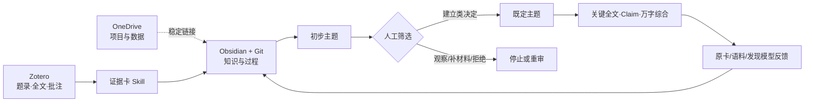

# Water Conservancy Intelligent Platform

这是一个面向水利科研的可追溯知识工作平台。它把 Zotero 中的来源转换为可以核对原文的证据卡；再把一批证据卡整理为初步主题，经人工筛选后建立既定主题，继续完成关键全文选择、Claim 准入、万字主题综合、证据反馈和导师决定。

本仓库是团队共享的知识与工作流仓库：保存 Markdown、模板、Skill、校验脚本、来源链接、任务和 Git 历史；不保存文献 PDF、Zotero 数据库、OneDrive 实体数据、账号凭据和个人机器路径。

> 当前正式远端：[wangxinyu20429-dotcom/Water-Conservancy-Intelligent-Platform](https://github.com/wangxinyu20429-dotcom/Water-Conservancy-Intelligent-Platform)。历史迁移来源只在 [MIGRATION.md](MIGRATION.md) 中留档，不再作为运行入口。

## 当前材料状态

截至 2026-09-10，仓库已经具备执行证据卡和两级主题流程的规则、模板与脚本，但“有工具”和“科研任务已经验收”是两件事。

| 材料 | 当前状态 | 能否直接用于科研结论 |
| --- | --- | --- |
| Zotero“科研平台”集合 42 个唯一来源 | 1 张首篇详细卡加 41 张集合卡均已登记；批次草稿结构校验通过 | 不能批量直接使用，仍须按卡片阅读范围和核验状态判断 |
| 证据卡 Skill | `hydrology-evidence-cards` V1.7，含 8 类来源模板、第 9 类平台决策卡和 R01—R09 校验 | Skill PASS 只证明结构完整，不证明原文理解正确 |
| 5 份原候选主题档案 | 正文均达到一万可见科学字符的旧候选档案；作为新流程的待筛选输入 | 不能，它们还不是完成人工决定的既定主题 |
| 主题 Skill | `hydrology-theme-synthesis` V1.3，含初步主题、人工筛选、既定主题和运行账 | 只有通过人工建立类决定的主题才能继续承载证据综合 |
| T10 实际筛选任务 | [Issue #16](https://github.com/wangxinyu20429-dotcom/Water-Conservancy-Intelligent-Platform/issues/16) 已建立并归入 M1 | 尚未完成：缺 V1.3 运行账、5 份初步主题筛选记录、5×5 关系处置表和人工决定 |
| 既定主题 | 应由 `establish`、`rename_then_establish` 或 `merge` 决定产生 | 当前没有；不得为了凑数量自动建立 |

当前 5 份主题文件能够通过兼容旧 `candidate_dossier` 的主题草稿校验，却不能通过 V1.3 的初步主题校验。旧运行记录也不能通过 V1.3 运行账校验。因此下一步是执行 T10 的人工筛选，不是继续把旧候选正文写长。

## 四个工具怎样分工

| 工具 | 保存什么 | 不保存什么 |
| --- | --- | --- |
| OneDrive | 项目原件、RAW/INTERIM/PROCESSED 数据、运行记录、图表和正式交付 | Zotero 数据库、团队知识正文的第二份副本 |
| Zotero | 题录、DOI、合法取得的 PDF/附件、版本关系和原文批注 | 主题结论、项目数据和 Git 协作历史 |
| Obsidian | 本仓库的本地工作副本；阅读和编写证据卡、主题、问题与创新候选 | 文献全文和大体量项目数据 |
| GitHub | 可共享的 Markdown、Skill、脚本、模板、来源链接、Issue 和版本历史 | PDF、Zotero 数据库、OneDrive 实体数据、凭据和本机绝对路径 |

同一科研内容只保留一份正式 Markdown。Obsidian 是本地编辑界面，Git/GitHub 保存同一批文件的可恢复历史，不另建一套平行正文。



## 从问题到既定主题的完整工作流

### 1. 冻结研究问题和允许的结论

写清本轮要回答的问题、用途、水利对象、空间和时间范围、语言、来源类型、纳入排除条件、截止日期和最高允许结论。问题只能写成“看看有什么”时，本轮保持探索状态，不建立既定主题。

人工决定点：问题是否值得投入、边界是否清楚、结果用于综述梳理、全文排队、研究问题讨论还是其他用途。

### 2. 选择小样本、大语料或混合路线

- `small_sample`：已经有几十篇高度相关的 Zotero 来源、全文或证据卡，适合逐篇理解后形成初步主题；当前 42 来源批次属于这一路线。
- `large_corpus`：有数百至数十万条可追溯题录，才适合实体抽取、规则识别、主题建模、稳定性和趋势分析。
- `hybrid`：真实的大语料地图与专家选择的小样本同时存在，并且能够分别说明每项输出来自哪条路线。

小样本没有足够年度切片和分母时，主题增长率写 `not_applicable`，不制造趋势。Hu 等论文提供的是大语料发现思路，没有提供本平台各优先级指标的综合阅读权重。

### 3. 在 Zotero 中确认唯一来源版本

用题名、作者、年份、DOI/ISBN/报告号和附件首页消歧。来源的知识身份、实际读取版本和 Zotero item key 都要明确。搜索出现多个条目时不能自动选择第一条；预印本、正式发表版、修订版和报告版要记录版本关系。

全文继续留在每位成员合法使用的 Zotero 或授权文件系统。GitHub 只保存稳定标识、来源链接和基于原文形成的知识记录。

### 4. 建立一篇来源一张证据卡

先选择来源类型，再选择完成级别和必要方法模块：

| 来源类型 | 模板入口 | 科学重点 |
| --- | --- | --- |
| 原创研究 | [01 原创研究](docs/证据卡模板/01_原创研究证据卡模板.md) | 对象、真实数据、分析单位、方法链、比较/验证、关键结果和边界 |
| 综述与证据综合 | [02 综述](docs/证据卡模板/02_综述与证据综合证据卡模板.md) | 检索范围、纳入排除、重叠、偏倚、异质性和综合结论 |
| 调查监测与统计报告 | [03 调查监测](docs/证据卡模板/03_调查监测与统计报告证据卡模板.md) | 覆盖范围、测量口径、分母、修订、不确定性和可比性 |
| 工程项目报告 | [04 工程报告](docs/证据卡模板/04_工程项目报告证据卡模板.md) | 证据层级、判据、边界条件、实测/模拟、失效和剩余风险 |
| 图书与章节 | [05 图书章节](docs/证据卡模板/05_图书与章节证据卡模板.md) | 命题、定义、推导、来源谱系和适用域 |
| 标准指南与政策 | [06 标准指南政策](docs/证据卡模板/06_标准指南与政策证据卡模板.md) | 权威性、条款、效力、适用条件、版本和科学边界 |
| 数据集与数据产品 | [07 数据产品](docs/证据卡模板/07_数据集及数据产品证据卡模板.md) | 固定版本、生成过程、变量、质量、许可和适用性 |
| 软件模型与代码 | [08 软件模型代码](docs/证据卡模板/08_软件模型与代码证据卡模板.md) | 固定制品、输入输出、实际运行、实现验证和科学验证 |
| 平台综合决策 | [09 决策卡](docs/证据卡模板/09_平台证据综合与决策卡模板.md) | 跨来源 Claim、独立性、冲突、迁移边界和当前决定 |

L0 只登记身份；L1 用于分析性筛选；L2 至少有一条带原文位置并完成 source check 的可用 Claim；L3 只在明确决策、决定性缺口和新材料可能改变判断三门同时满足时启动。

凡声明读取了完整或部分主文，读者可见正文必须真正讲清研究问题、对象、数据、方法、验证、结果、作者解释、科学贡献和结论边界。L1 至少 5,000 个非空白可见字符，L2/L3 至少 6,000；折叠校勘、机器字段、题录和链接不计数。短公告、目录页或未取得正文的来源按材料上限收口，不能为过字数线编造内容。

### 5. 对 Claim 做原文准入

每个 Claim 只表达一个可检查命题，保留方向、数值、单位、分母、比较对象、不确定性、限定语和可重复定位。题名、摘要、机器抽取、期刊影响力或主题概率不能替代 Claim 准入。

只有人工重新打开原文位置并核对后，L2/L3 Claim 才能进入平台决策卡和既定主题。校验脚本检查字段和边界，不能替人证明科学正确。

### 6. 为一次主题工作建立运行账

运行账冻结问题、输入提交、路线、初步主题、人工决定、既定主题、阅读资源、全文队列、反馈、重算和导师决定。它只保存过程和链接，不复制主题正文。

公开模板：[主题工作流运行账 V1.3](docs/主题模板/03_主题工作流运行账模板_V1.3.md)。

### 7. 形成初步主题

初步主题是供人工筛选的方向假设。每个初步主题单独一个 Markdown，至少写清：

- 可能的科学问题及其形成依据；
- 3—5 项代表来源及实际可读范围；
- 模糊、桥接和离群来源；
- 对象、过程、尺度、时间、空间、数据、方法和结果的暂定边界；
- 与相邻初步主题的重叠和实质差异；
- 小样本偏差或大语料模型稳定性；
- 当前不能写成的结论。

初步主题的 `allowed_use` 必须是 `screening_only`。它可以重叠、拆分、观察或被拒绝，不能承载领域共识、研究空白、创新点和论文结论。

公开模板：[初步主题与人工筛选 V1.3](docs/主题模板/01_初步主题与人工筛选模板_V1.3.md)。

### 8. 逐项完成人工筛选

人工对每个初步主题记录且只记录一个当前有效决定：

| 决定 | 什么时候使用 | 结果 |
| --- | --- | --- |
| `establish` | 当前名称、问题和边界足够清楚 | 建立一个既定主题 |
| `rename_then_establish` | 方向成立，但名称或范围需要修正 | 改名并建立既定主题 |
| `merge` | 多个初步主题实质回答同一问题 | 合并后建立一个既定主题 |
| `split_and_rescreen` | 一个主题混入多个不能共用证据链的问题 | 生成新的初步主题并重新筛选 |
| `watch` | 有方向信号，当前价值或证据不足 | 保留观察，不进入既定主题证据链 |
| `supplement_before_decision` | 缺少可能改变决定的最小材料 | 补材料后再回本决策门 |
| `reject` | 只是标签、误分，或没有持续科研问题 | 停止推进并保留理由 |

决定必须包含唯一编号、对象、依据、理由、决定者、日期、适用范围、产生对象、停止或复核条件。本人先读后以同伴检查角色再次复查时，必须如实写“本人二次检查”，不能虚构第二个人。

### 9. 只为通过筛选的方向建立既定主题

既定主题必须回链来源初步主题和人工决定，冻结核心问题、纳入排除边界、跨主题材料处理和首批全文范围。`watch`、`supplement_before_decision`、`reject` 和尚未重新筛选的拆分项不能生成既定主题。

公开模板：[既定主题深度综合 V1.3](docs/主题模板/02_既定主题深度综合模板_V1.3.md)。

### 10. 分两层安排全文阅读资源

先在既定主题之间分配全文名额，再在同一既定主题内部排文献。两个层级不能混用：

- 主题层：研究问题关系、主题趋势、稳定性、语料覆盖、流域或对象缺口；主题增长率只属于这一层。
- 文献层：问题直接性、关键缺口闭合价值、预期科学作用、新近性、同学科同年份标准化引用和经核期刊信号。

发现阶段默认保留分项、来源、缺项和理由，不计算综合总分。只有预登记试运行、完成权重敏感性分析并由导师冻结后，才允许使用发现阶段综合权重。

证据卡形成后的补核关注分另用 E25/D20/G15/R25/V15。它只回答先检查什么，不回答哪篇论文更正确，也不改变 Claim 的核验状态。

### 11. 建立比较框架并深化既定主题

跨来源比较先对齐水利对象、独立单位、地点、时期、事件/情景、输入信息、比较对象、指标、单位、分母、不确定性、验证方式、尺度和迁移条件。对象或口径不同造成的差异先写成异质性或不可比，不能把文字相反直接登记为科学冲突。

既定主题的可见科学正文至少 10,000 个非空白字符，并且要用实质内容讲清问题链、数据和测量、方法谱系、主要结果、发展变化、异质性、失败与负结果、证据边界、独立见解和反证条件。材料不足时标记 `BLOCKED_SOURCE_LIMIT`，不靠套话凑字数。

### 12. 形成有边界的见解和后续接口

每项独立见解列出来源前提、推理步骤、最强允许结论、迁移边界和可能推翻它的观察。当前集合没有发现某项工作，只能写“当前集合未见”，不能写“该领域无人研究”。

主题可把已核认识送入背景、综述、问题框架、方法选择和限制讨论。Idea 仍只是机会信号，未完成新颖性检索、反证检查、数据和方法可行性判断以及导师决定前，不能宣布创新成立。

### 13. 按三类反馈修整并重算

- `source_recheck`：回到具体全文、Claim 和原证据卡；说明最小材料和停止条件。
- `corpus_supplement`：补地区、时期、语言、来源类型、数据或方法文献，并保留新的检索记录。
- `discovery_model_correction`：修正 LLM、词典、规则、地理匹配或主题模型的系统性误提、漏提和错组。

原卡改变后重跑 Claim 准入、比较、主题综合和补核排序；语料改变后重跑去重、抽取、初步主题、趋势和受影响的人工筛选；发现模型改变后重跑受影响的抽取、聚类、趋势和筛选。修整写回原文件并利用 Git 保存历史，不建立“修正版证据卡”平行正文。

### 14. 由人工和导师收口

人工确认原文忠实性、可比性和见解边界；导师或授权者决定既定主题继续、改名、拆分、合并、暂停、归档，以及是否进入 Idea、论文或项目讨论。只在聊天里说过但未写回运行账或主题文件的决定，不算完成。

## 需要人工介入的关键位置

| 位置 | 人工必须决定的内容 |
| --- | --- |
| 问题与边界 | 研究意图、用途、对象、范围和最高结论 |
| 路线选择 | 小样本、大语料或混合路线是否与材料和成本匹配 |
| Zotero 消歧 | 使用哪个来源和版本，全文是否足以回答当前问题 |
| 初步主题解释 | 机器分组是否对应科研问题，代表、桥接和离群文献是否合理 |
| 初步主题筛选 | 建立、改名、合并、拆分、观察、补材料或拒绝 |
| 阅读资源 | 哪些既定主题先投入，主题内哪些全文先读 |
| Claim 准入 | 表述是否忠于原文，数值、范围、限定语和定位是否完整 |
| 可比性 | 多篇结果是同一框架、情境差异、不可比还是真冲突 |
| 见解复核 | 推理是否越过证据，边界和反证条件是否充分 |
| 反馈和重跑 | 缺口属于原卡、语料还是发现模型，重跑到哪一步 |
| 生命周期和出口 | 主题是否继续，以及是否进入 Idea 和写作流程 |

AI 可以搜索、抽取、整理、计算、发现遗漏、起草和运行结构校验；AI 不能替代上述决定，也不能把机器 PASS 写成科学正确。

## 在另一台电脑上安装并运行

### A. 准备软件和权限

最低需要：

1. Git，并拥有本私有仓库的读取权限；需要提交时还要有写入或 Pull Request 权限。
2. Python 3.10 或更高版本。当前脚本只使用 Python 标准库，无需额外安装依赖；本仓库最近在 Python 3.12.4 上完成自测。
3. Zotero Desktop，用于保存本人合法取得的文献和附件，并提供本地只读 API。
4. Obsidian，用于把克隆目录作为知识库打开；零社区插件也能完整阅读。
5. Codex。要让 Codex 自动执行两套工作流，需要把仓库中的两个 Skill 安装到个人 Skill 目录。

### B. 克隆仓库并确认远端

```powershell
git clone https://github.com/wangxinyu20429-dotcom/Water-Conservancy-Intelligent-Platform.git
cd Water-Conservancy-Intelligent-Platform
git switch main
git pull --ff-only origin main
git remote -v
```

`origin` 应显示 `wangxinyu20429-dotcom/Water-Conservancy-Intelligent-Platform`。首次加入私有仓库时，按 GitHub 正常登录流程完成授权，不把令牌写进本仓库。

### C. 在 Obsidian 中打开

打开 Obsidian，选择“打开本地仓库/文件夹作为仓库”，选中刚克隆的 `Water-Conservancy-Intelligent-Platform` 文件夹。不要只复制其中几个 Markdown；整个 Git 目录、相对链接、模板和脚本需要保持在一起。

如果希望放进已有 Obsidian 总库，也应把整个仓库作为一个完整子目录克隆进去，并始终在该子目录根部运行 Git 命令。

### D. 安装两个 Codex Skill

Windows PowerShell：

```powershell
$SkillHome = Join-Path $env:USERPROFILE '.codex\skills'
New-Item -ItemType Directory -Force -Path $SkillHome
Copy-Item -Recurse -Force '.\skills\hydrology-evidence-cards' $SkillHome
Copy-Item -Recurse -Force '.\skills\hydrology-theme-synthesis' $SkillHome
```

macOS/Linux：

```bash
mkdir -p ~/.codex/skills
cp -R skills/hydrology-evidence-cards ~/.codex/skills/
cp -R skills/hydrology-theme-synthesis ~/.codex/skills/
```

重启 Codex 后，可以显式调用 `$hydrology-evidence-cards` 或 `$hydrology-theme-synthesis`。仓库内版本升级后，重新复制对应 Skill；不要只复制 `SKILL.md`，其 `assets`、`references`、`schemas`、`scripts` 和 `tests` 必须一起保留。

### E. 运行两套 Skill 自测

在仓库根目录运行：

```powershell
python skills/hydrology-evidence-cards/tests/self_test.py
python skills/hydrology-theme-synthesis/tests/self_test.py
```

两条命令都应结束于全部测试通过。自测验证的是模板、构建器和校验器约束，不验证某一篇文献或某一个主题的科学正确性。

### F. 连接本人 Zotero

先打开 Zotero Desktop，再运行：

```powershell
python skills/hydrology-evidence-cards/scripts/zotero_reader.py status
python skills/hydrology-evidence-cards/scripts/zotero_reader.py search "题名、作者、DOI或关键词" --out "$env:TEMP\wcip-zotero-search.json"
```

默认本地 API 地址是 `http://127.0.0.1:23119`。如果 `status` 连接失败，先确认 Zotero 正在运行并启用了本地 API。其他成员必须在自己的 Zotero 中准备条目和附件；Skill 不会传输私人 Zotero 库。

确认唯一 item key 后，可以建立临时读取包：

```powershell
python skills/hydrology-evidence-cards/scripts/zotero_reader.py packet ITEMKEY --out-dir "$env:TEMP\wcip-packet-ITEMKEY"
```

临时包可能包含索引全文，只能放系统临时目录或授权目录，用完删除，禁止提交 Git。

### G. 建立和校验证据卡

以下命令生成骨架，不能代替阅读原文：

```powershell
python skills/hydrology-evidence-cards/scripts/new_card.py --type original-research --level L1 --card-id EC-YYYYMMDD-001 --title "来源短题名" --source-work-id WORK-001 --manifestation-id SRC-001-V1 --source-version published-v1 --zotero-item-key ITEMKEY --reading-scope abstract --extraction-method ai_assisted --output "证据卡/EC-YYYYMMDD-001_来源短题名.md"
python skills/hydrology-evidence-cards/scripts/validate_card.py "证据卡/EC-YYYYMMDD-001_来源短题名.md" --mode draft --index-root .
```

填写实际阅读范围、可见科学正文、Cxx 定位和人工复核后，再运行 `--mode final`。多卡批次还要运行：

```powershell
python skills/hydrology-evidence-cards/scripts/validate_batch.py 证据卡 --mode draft
```

完整命令和边界见 [Zotero 本地读取](skills/hydrology-evidence-cards/references/zotero-access.md)、[证据卡工作流](skills/hydrology-evidence-cards/references/workflow.md) 和 [安装说明](skills/hydrology-evidence-cards/references/installation.md)。

### H. 建立主题运行账和初步主题

```powershell
python skills/hydrology-theme-synthesis/scripts/init_workflow_run.py --workflow-ref "run:YYYYMMDD-example" --title "本轮主题发现与筛选" --question "本轮要回答的科研问题" --intended-use "初步主题发现与人工筛选" --route small_sample --output "运行记录/YYYYMMDD_主题工作流.md"
python skills/hydrology-theme-synthesis/scripts/validate_workflow_run.py "运行记录/YYYYMMDD_主题工作流.md" --mode draft

python skills/hydrology-theme-synthesis/scripts/init_preliminary_theme.py --preliminary-theme-ref "pt:example" --title "示例方向（初步主题）" --discovery-route small_sample --workflow-run-ref "run:YYYYMMDD-example" --output "主题/初步主题_示例方向.md"
python skills/hydrology-theme-synthesis/scripts/validate_preliminary_theme.py "主题/初步主题_示例方向.md" --mode draft
```

把形成依据、代表/模糊/桥接/离群来源、边界和相邻关系写实。人工完成唯一筛选决定后，先运行初步主题 `--mode final`。只有建立类决定通过后，才能执行：

```powershell
python skills/hydrology-theme-synthesis/scripts/build_theme.py --theme-ref "et:example" --title "示例既定主题" --question "人工确认后的核心问题" --intended-use "深度主题综合" --preliminary-theme-file "主题/初步主题_示例方向.md" --cards-dir 证据卡 --output "主题/既定主题_示例方向.md"
python skills/hydrology-theme-synthesis/scripts/validate_theme.py "主题/既定主题_示例方向.md" --mode draft --index-root .
```

没有完成人工建立决定时，构建器应停止；不能手工绕过该准入门。完整说明见 [主题执行与交付](skills/hydrology-theme-synthesis/references/execution.md)。

### I. 提交知识文件

普通协作者从新分支提交：

```powershell
git switch -c student/姓名/任务编号
git status --short
git add README.md docs skills 证据卡 主题 运行记录
git diff --cached --check
git commit -m "中文说明本次科研知识变更"
git push -u origin student/姓名/任务编号
```

随后在 GitHub 建立 Pull Request，逐项说明输入来源、阅读范围、人工核验、校验结果和未决问题。不要使用 `git add .` 把 PDF、临时包、缓存、凭据或 OneDrive 数据一起加入。正式 `main` 由维护者按仓库约定合并；只有维护者明确授权时才直接更新 `main`。

提交前至少检查：

```powershell
git status --short
git diff --cached --name-only
git diff --cached --check
git ls-files | Select-String -Pattern '\.(pdf|docx?|xlsx?|pptx?|zip|sqlite|bib|ris)$'
```

最后一条正常情况下不应列出受限全文、数据库或项目实体文件。

## 当前 T10 应该怎样执行

[T10 / Issue #16](https://github.com/wangxinyu20429-dotcom/Water-Conservancy-Intelligent-Platform/issues/16) 是当前把旧 5 个候选档案迁入新流程的实际任务。严格按以下顺序操作：

1. 记录本轮输入 Git 提交：5 份旧主题、42 卡索引和旧运行记录；新建 V1.3 主题工作流运行账。
2. 从每份旧主题提取真实形成依据，分别建立 5 份 `screening_only` 初步主题文件；旧万字正文只能作为待核输入，不能自动成为已核结论。
3. 每个初步主题选择 3—5 项代表来源，另列模糊/桥接和离群来源，注明实际阅读范围。
4. 对 5 个主题逐对做 5×5 关系检查。矩阵对称位置只保存一份判断，共需审查 10 对关系；逐对写共同问题、实质差异、证据链能否共用和建议处置。
5. 初读整理后由本人再做一次独立二次检查，如实记录同一人的两轮角色和时间。
6. 导师或授权者逐项填写唯一决定编号、决定、理由、日期、产生对象以及停止/复核条件。
7. 拆分项回到初步主题筛选；观察、补材料和拒绝项停止；只对建立、改名后建立或合并项建立既定主题。
8. 为每个既定主题冻结核心问题、纳入排除边界和首批关键全文队列。此时只是安排阅读，不能升级未核 Claim。
9. 更新批次 README 和运行账，列明每个旧对象的最终去向；运行初步主题、运行账和既定主题相应校验。
10. 提交后从 GitHub `main` 读回，核对文件、相对链接、决定状态和输入提交。

T10 的必交内容是：1 份 V1.3 运行账、5 份初步主题筛选记录或拆分谱系、1 份五主题关系与处置总表、仅由建立类决定产生的既定主题，以及更新后的主题批次 README。当前仓库只具备执行这些工作的输入和模板，人工决定尚未发生。

## 目录入口

- [产品与流程](docs/产品与流程)：产品说明、操作手册、工作入口、填写模板、任务顺序和验收。
- [证据卡模板](docs/证据卡模板)：V1.7 公共骨架、八类来源入口和平台综合决策卡。
- [证据卡模块](docs/证据卡模块)：水利情境与预测、模拟、频率气候、监测遥感、工程安全方法模块。
- [证据卡规范](docs/证据卡规范)：科学架构、外部实践对照、原文忠实性和质量检查。
- [主题模板](docs/主题模板)：初步主题筛选、既定主题深度综合和工作流运行账。
- [主题规范](docs/主题规范)：文献发现、人工筛选、优先级、深度综合和反馈闭环。
- [可安装 Skills](skills)：两套可复制到其他电脑的完整 Skill。
- [42 张证据卡索引](证据卡/科研平台集合_20260907/README.md)：本轮真实 Zotero 来源入口。
- [5 个待筛选主题](主题/候选主题_科研平台集合_20260907/README.md)：T10 的旧候选输入。
- [旧批次运行记录](运行记录/ZOTERO-RUN-20260907-01_科研平台集合全量初读与候选主题.md)：保留第一次运行边界，不能代替新的 V1.3 筛选运行账。
- [完整横版工作流](docs/主题规范/03_AI辅助水利文献发现到深度主题形成工作流_讨论稿.md)：结合 Hu 等论文的大语料发现方法和本平台证据链。
- [迁移说明](MIGRATION.md)：旧 Project 和旧仓库内容的历史对应。

## GitHub 任务与里程碑

| 任务 | 内容 | 里程碑 |
| --- | --- | --- |
| [T01 / #1](https://github.com/wangxinyu20429-dotcom/Water-Conservancy-Intelligent-Platform/issues/1) | 建立 OneDrive 目录并确认 Zotero、Obsidian 与 GitHub 入口 | M0 |
| [T02 / #2](https://github.com/wangxinyu20429-dotcom/Water-Conservancy-Intelligent-Platform/issues/2) | 把一份真实材料收进 Zotero 并登记文献链接 | M0 |
| [T03 / #3](https://github.com/wangxinyu20429-dotcom/Water-Conservancy-Intelligent-Platform/issues/3) | 建立唯一来源版本、真实 L0—L3 卡、Cxx 定位、人审和 R01—R09 结果 | M1 |
| [T04 / #4](https://github.com/wangxinyu20429-dotcom/Water-Conservancy-Intelligent-Platform/issues/4) | 通用的初步主题、人工筛选、既定主题、Claim 准入和万字综合流程 | M1 |
| [T05 / #5](https://github.com/wangxinyu20429-dotcom/Water-Conservancy-Intelligent-Platform/issues/5) | 用主题反推原卡承重缺口，按三门补核并重算 | M1 |
| [T06 / #6](https://github.com/wangxinyu20429-dotcom/Water-Conservancy-Intelligent-Platform/issues/6) | 从已核主题声明形成机会信号和写作接口 | M1 |
| [T07 / #7](https://github.com/wangxinyu20429-dotcom/Water-Conservancy-Intelligent-Platform/issues/7) | 同步 Obsidian 知识文件并检查 GitHub 读回 | M1 |
| [T08 / #8](https://github.com/wangxinyu20429-dotcom/Water-Conservancy-Intelligent-Platform/issues/8) | 用真实材料检查整条流程并记录未通过环节 | M1 |
| [T09 / #9](https://github.com/wangxinyu20429-dotcom/Water-Conservancy-Intelligent-Platform/issues/9) | 修复真实发现的问题并回到出错步骤复验 | M2 |
| [T10 / #16](https://github.com/wangxinyu20429-dotcom/Water-Conservancy-Intelligent-Platform/issues/16) | 逐项筛选当前 5 个初步主题并建立符合条件的既定主题 | M1 |

里程碑：[M0](https://github.com/wangxinyu20429-dotcom/Water-Conservancy-Intelligent-Platform/milestone/1) · [M1](https://github.com/wangxinyu20429-dotcom/Water-Conservancy-Intelligent-Platform/milestone/2) · [M2](https://github.com/wangxinyu20429-dotcom/Water-Conservancy-Intelligent-Platform/milestone/3)

## 常见受阻情况

| 现象 | 处理 |
| --- | --- |
| Zotero `status` 连接失败 | 打开 Zotero Desktop，确认本地 API 已启用，再重试；不要直接读写 `zotero.sqlite` |
| 搜索出现多个相似条目 | 核对题名、作者、年份、DOI、版本和附件首页，不能默认取第一条 |
| PDF 有附件但没有可用文本 | 如实记录 `not_obtained`、`not_read` 或 `not_found_after_check`，关键表图回看合法原件 |
| 证据卡 draft PASS | 继续人工核对原文；PASS 不等于 L2/L3 准入和科学正确 |
| 初步主题校验失败 | 检查是否使用 V1.3 独立初步主题模板、`screening_only` 状态和完整人工决定字段 |
| 构建既定主题被拒绝 | 先完成人工建立类决定，记录 resulting established theme reference；不得绕过 |
| 主题正文不足一万字符 | 补实际数据、方法、结果、比较、边界和反证；材料不足就标记受阻，不填充套话 |
| 本地与 GitHub 看起来不一致 | 比较 `git status`、`git rev-parse HEAD` 和远端 `main`；未提交草稿只存在本机 |
| 链接在他人电脑失效 | 改用仓库相对链接或公开稳定链接，删除个人盘符和临时文件路径 |

## 科研质量边界

- 摘要、机器抽取、模型分组、年份、引用和期刊信号都不能冒充全文证据。
- 官方报告、标准和政策只在其权威范围内支持事实或规范，不能自动证明科学方法有效。
- 代码可下载、安装成功、输出生成和复现论文结果是不同状态。
- 不同对象、时期、尺度、指标和验证设计先检查可比性，不能为了“制造冲突”强行对立。
- 一次来源只建立一份正式证据卡；精读和反馈写回原卡，Git 保存版本历史。
- 任何既定主题都必须回到初步主题和人工筛选决定；任何承重认识都必须沿主题声明 → Claim → 原文位置回查。
- 任何创新候选都必须说明当前证据、最近工作、未完成的新颖性检索、反证和可行性缺口，并由导师决定是否继续。
