# AI辅助水利文献发现到深度主题形成工作流（讨论稿）

形成日期：2026-09-09
最近修订：2026-09-10（增加“初步主题—人工筛选—既定主题”两阶段主题机制）
文件状态：讨论稿，已同步Git供课题组评审，尚未冻结为正式规则
适用范围：水利科研平台中的外部文献发现、Zotero文献管理、初步主题形成与人工筛选、既定主题深化、证据卡生成与原卡反馈
核心参考：Hu, J., Miao, C., Wu, Y., & Su, J. *Advances in hydrological research in China over the past two decades: Insights from advanced large language model and topic modeling*. Fundamental Research, 6(2), 994–1004. DOI: [10.1016/j.fmre.2025.05.002](https://doi.org/10.1016/j.fmre.2025.05.002)；[开放全文](https://pmc.ncbi.nlm.nih.gov/articles/PMC13069845/)；[配套模型、参数与提示词](https://zenodo.org/records/15095630)。
筛选与审计对照：[Cochrane Handbook Chapter 4: Searching for and selecting studies](https://training.cochrane.org/handbook/current/chapter-04)；[PRISMA 2020 flow diagram](https://www.prisma-statement.org/prisma-2020-flow-diagram)。

> 本文件将论文方法转化为课题组工作流。凡标为“论文方法”的内容，来自论文公开正文或配套材料；凡标为“平台设计”的内容，是结合本项目目标作出的流程设计，不冒充论文原结论。

## 1. 工作流要解决的问题

本工作流要把数量不断增长的水利文献转化为可审计、可深化、可用于科研判断的知识链。最终目标不是得到若干漂亮的主题名称，而是回答以下问题：

1. 当前文献集合主要覆盖哪些水利研究方向，分别研究什么对象、过程和问题？
2. 各方向在时间、流域、空间尺度、数据、方法和任务类型上如何变化？
3. 哪些文献只是与主题相关，哪些文献真正承担定义、方法、数据、结果、反证或边界作用？
4. 一个主题中已经形成了哪些可靠认识，哪些只是摘要线索、机器聚类结果或分析者推断？
5. 当前证据卡缺少什么信息，必须回到哪篇原文、哪一章节或哪一图表补核？
6. 哪些主题已具备形成研究问题和Idea的基础，哪些仍需补文献、补证据或重新划定边界？

工作流将“发现研究方向”和“证明科学认识”分成不同阶段。主题模型可以帮助发现语料结构，LLM可以帮助提取实体和形成候选解释，但只有经过全文核查的证据卡才能承担具体科学结论。

## 2. 从参考论文中直接借鉴什么

### 2.1 论文实际采用的技术分工

参考论文检索了2000年1月至2023年10月的Web of Science水文相关记录。最初获得289,513条记录，经研究区域解析、期刊学科和中国区域筛选后，最终以4,177篇文献分析中国水文研究。论文没有让单一AI模型完成全部综述，而是把任务拆开：

- **LLM实体抽取**：根据题名和摘要提取研究区域名称；
- **地理编码与空间匹配**：把区域名称转换为坐标，再匹配到中国主要流域；
- **正则表达式识别**：从题名和摘要中识别可能使用的水文模型；
- **传统文献计量**：分析发文、合作、机构、关键词等特征；
- **动态主题模型**：从摘要中识别潜在主题及其年度变化；
- **趋势统计**：使用Theil–Sen斜率和Mann–Kendall检验判断趋势；
- **研究人员解释**：结合水文学科知识解释主题、流域差异和发展方向。

### 2.2 对本平台最重要的启示

1. 不让LLM同时承担检索、分类、证据评价和科研结论生成。
2. 每次筛选都要保留输入数量、输出数量、失败数量及排除原因。
3. 实体抽取、规则匹配、统计聚类与科学解释应分别验证。
4. 主题应具有时间、空间、流域、方法和数据维度，不能只是一组关键词。
5. 提示词、模型版本、参数、词表和人工修改应能够追溯。
6. 大规模语料分析用于发现初步主题；是否建立既定主题由人工筛选，具体科研认识仍需回到论文全文。

### 2.3 论文已经说明的限制

参考论文明确指出，其研究只使用WoS英文文献，没有纳入中文期刊；研究区域名称抽取和地理编码限制了可利用的文献数量；通过题名和摘要的正则匹配不能捕捉实际使用的全部水文模型。平台在借鉴时必须保留这些边界，不能把题名摘要层面的识别写成全文证据，也不能把文献出现频率解释成模型有效性或科学正确性。

## 3. 总体架构

```mermaid
%%{init: {
  "theme": "base",
  "flowchart": {
    "nodeSpacing": 22,
    "rankSpacing": 38,
    "curve": "basis",
    "htmlLabels": true
  },
  "themeVariables": {
    "fontSize": "22px",
    "fontFamily": "Microsoft YaHei"
  }
}}%%
flowchart LR

    subgraph STAGE1["① 研究任务入口"]
        direction TB
        A["明确科研问题与用途<br/>时间 · 空间 · 流域 · 对象"]
        B["冻结研究边界<br/>纳入条件 · 排除条件 · 结论层级"]
        C{"选择处理路线"}
        A --> B --> C
    end

    subgraph STAGE2["② 初步主题与人工筛选"]
        direction TB
        S["小样本路线<br/>核对Zotero、题录、版本和全文"]
        L["大语料路线<br/>检索去重 → LLM与规则提取<br/>DTM主题 → 趋势与稳定性检验"]
        PT["形成初步主题（筛选用）<br/>形成依据 · 代表文献 · 边界假设<br/>稳定性 · 模糊项 · 相邻主题"]
        H{"人工主题筛选门<br/>建立 · 改名 · 合并 · 拆分<br/>观察 · 补材料 · 拒绝"}
        ET["既定主题<br/>核心问题 · 纳入排除边界<br/>来源初步主题 · 决定记录"]
        W["观察／补材料／拒绝<br/>不进入既定主题证据链"]
        S --> PT
        L --> PT
        PT --> H
        H -->|通过| ET
        H -->|未通过或暂缓| W
    end

    C -->|"几十篇相关文献"| S
    C -->|"数百至数十万条题录"| L

    subgraph STAGE3["③ 关键全文与证据"]
        direction TB
        P1["主题层排序<br/>增长趋势 · 研究覆盖 · 流域缺口"]
        P2["文献层排序<br/>问题相关性 · 缺口价值 · 年份<br/>标准化引用 · 期刊学科位置"]
        P3["形成关键全文队列<br/>先读 · 后读 · 暂缓"]
        E["全文证据卡<br/>问题 · 数据 · 方法 · 结果<br/>限制 · 原文定位"]
        G{"Claim准入<br/>原文支持？范围明确？可以比较？"}
        P1 --> P2 --> P3 --> E --> G
    end

    ET --> P1

    subgraph STAGE4["④ 既定主题深化与见解"]
        direction TB
        T1["万字深度主题<br/>问题脉络 · 对象与数据<br/>方法比较 · 结果综合"]
        T2["证据关系分析<br/>一致认识 · 条件差异<br/>边界证据 · 知识缺口"]
        I["推导独到见解<br/>每条见解回链Claim和原文"]
        T1 --> T2 --> I
    end

    G -->|"准入"| T1
    G -->|"证据不足"| E

    subgraph STAGE5["⑤ 反馈闭环与导师决定"]
        direction TB
        F{"发现决定性缺口？"}
        F1["原文没核清<br/>补核全文并修改原证据卡"]
        F2["相关文献缺失<br/>修订检索并补充语料"]
        F3["分类存在偏差<br/>修改词典、规则、提示词或模型"]
        R["重新运行受影响环节<br/>更新Claim、主题和优先级"]
        D["导师决定<br/>继续深化 · 拆分合并<br/>进入Idea · 暂停归档"]

        F -->|"原文缺口"| F1
        F -->|"语料缺口"| F2
        F -->|"分类缺口"| F3
        F -->|"达到停止条件"| R
        R --> D
    end

    I --> F
    F1 -.修订证据.-> E
    F2 -.补充语料.-> L
    F3 -.重新发现方向.-> L
    D -.继续补证据.-> P3
    D -.边界变化需重新人工审查.-> H

    classDef entry fill:#DCEBFF,stroke:#2F65A7,stroke-width:2px,color:#15375F;
    classDef discovery fill:#E5F1FF,stroke:#4277A9,stroke-width:2px,color:#173A5E;
    classDef evidence fill:#FFF1C7,stroke:#C48A00,stroke-width:2px,color:#594000;
    classDef synthesis fill:#E7F5E9,stroke:#3E8750,stroke-width:2px,color:#183F23;
    classDef feedback fill:#F7E7F2,stroke:#92557F,stroke-width:2px,color:#512640;

    class A,B,C entry;
    class S,L,PT,H,ET,W discovery;
    class P1,P2,P3,E,G evidence;
    class T1,T2,I synthesis;
    class F,F1,F2,F3,R,D feedback;
```

平台包含两条可以独立运行、最终汇合的路线：

- **小样本深读路线**：适用于当前Zotero中几十篇高度相关文献，先依据题名、摘要、全文状态和已有证据卡形成初步主题，再经人工筛选建立既定主题，不强行运行DTM。
- **大语料发现路线**：适用于数百至数十万条题录，通过实体抽取、规则识别、主题建模和趋势分析形成初步主题，再经人工筛选建立既定主题并选择关键文献。

是否采用主题模型不由固定文献数量机械决定，而由语料规模、各时间切片样本量、主题稳定性和研究用途共同决定。样本不足或稳定性检查不通过时，系统必须降级为候选聚类，并明确标为探索性结果。

横版流程把完整工作组织为五个连续阶段：研究任务入口、初步主题与人工筛选、关键全文与证据、既定主题深化与见解、反馈闭环与导师决定。参考论文中的LLM实体抽取、规则识别、DTM和趋势统计进入大语料路线；初步主题只负责暴露可能方向，人工筛选门决定哪些方向成为既定主题；关键全文、证据卡、Claim准入、万字正文和三类反馈继续充实同一个既定主题。两条路线在人工筛选门汇合。

### 3.1 四种输出不得混写

工作流中的陈述分为四类，任何文件都应能辨认其来源和权限：

| 输出类型 | 例子 | 可以回答什么 | 不能冒充什么 |
| --- | --- | --- | --- |
| 语料统计 | 某主题在特定年份的文献占比上升 | 数据库检索结果中出现了什么模式 | 现实世界过程变强或该方向更正确 |
| 原文证据 | 某论文在特定数据和场景下报告了某项结果 | 单项研究实际研究和发现了什么 | 跨地区、跨尺度的一般规律 |
| 综合推断 | 多项可比证据共同指向某种条件性认识 | 当前证据集合允许怎样解释 | 已被实验直接证明的新事实 |
| 导师决定 | 主题继续、暂停、拆分或进入Idea讨论 | 课题组下一步做什么 | 证据本身的真假和强弱 |

### 3.2 分析单位必须固定

同一流程中存在多个分析单位，混用会造成数量失真和证据重复：

| 单位 | 定义 | 主要用途 |
| --- | --- | --- |
| 题录记录 | 数据库返回的一条记录 | 检索漏斗和来源审计 |
| 文献报告 | 一篇论文、报告、预印本或勘误 | 全文获取和版本管理 |
| 独立研究 | 共享同一研究设计、样本或实验的报告集合 | 判断证据独立性 |
| 证据Claim | 有范围和原文定位的最小科学命题 | 主题承重与比较 |
| 候选主题簇 | 文本或字段相似形成的机器分组 | 发现和导航 |
| 初步主题 | 由候选簇或小样本分组整理出的筛选对象，允许重叠和不稳定 | 判断是否值得建立主题 |
| 既定主题 | 经人工批准、围绕明确问题和边界持续组织证据的主题 | 关键全文、证据综合和后续写作 |

发文量按文献报告统计；证据数量按独立研究和Claim统计；主题建模以事先声明的文本单位运行。三种数量不能互相替代。

## 4. 全流程阶段与操作要求

## 阶段00：研究任务登记与边界冻结

### 目标

在获取文献前明确本轮想认识什么，避免搜索式、主题数量和模型输出反过来定义研究问题。

### 必填内容

- 研究问题或方向描述；
- 预期用途：领域地图、研究现状、方法比较、数据盘点、Idea准备或写作支持；
- 时间范围；
- 空间范围和流域范围；
- 来源语言；
- 文献与非论文来源类型；
- 纳入与排除条件；
- 更新截止日期；
- 本轮允许形成的结论层级。

### 输出

`corpus_scope`记录。它是所有检索、筛选和分析的上游约束。

### 停止条件

问题只能表达为“看看有什么”且无法说明用途时，先保留探索任务，不建立既定主题。

本文件是未来运行规划，不自动突破平台当前停止线。是否扩大检索、批量加工新文献、建立既定主题或进入Idea与成果出口，仍按项目现行规则和导师决定执行。

## 阶段01：语料获取与来源登记

### 论文方法

参考论文使用WoS，以“hydrolo*”和“water cycle”等宽口径词检索，再进行后续过滤。

### 平台设计

平台可从WoS、Scopus、OpenAlex、Crossref、CNKI、政府机构、数据仓库和用户指定清单获取题录。每个来源必须记录：

- 数据库或网站名称；
- 完整检索式；
- 检索日期；
- 时间、语言、文献类型和学科过滤条件；
- 返回数量；
- 可导出的字段；
- 数据许可和访问限制。

Zotero负责正式题录、DOI、附件和原始批注入口。OneDrive保存依法取得的全文、待处理附件、大型数据和运行中间产物。Obsidian/Git只保存必要的文献链接、证据卡、主题及审计记录，不上传受版权限制的全文。

### 输出

- 原始题录清单；
- 检索日志；
- 来源与许可登记；
- 本轮语料唯一批次标识。

### 验收

同一检索能够由另一名成员根据记录重新执行；无法复现的手工补入记录必须标明来源和原因。

检索可重现仍不等于检索覆盖充分。每次检索还应完成两种低成本检查：一是确认已知的代表性文献能否被检索式召回；二是分层抽查结果中的明显误收，并据此修订同义词、排除词和数据库字段。代表文献召回失败或误收集中于某一类来源时，不进入主题趋势分析。

## 阶段02：去重、版本归并与筛选漏斗

### 目标

区分“文献记录”“论文”“同一研究的多个报告”和“不同版本”，防止重复计数。

### 去重顺序

1. DOI完全匹配；
2. 数据库唯一编号匹配；
3. 规范化题名、作者和年份组合匹配；
4. 预印本、在线优先版和正式出版版的版本归并；
5. 同一研究的会议论文、期刊论文、数据论文和勘误建立关联，但不擅自删除。

### 筛选漏斗

每一步都记录：进入数量、保留数量、排除数量、无法判断数量、排除理由分布。推荐至少保留以下节点：

1. 初始检索结果；
2. 去重后；
3. 题名筛选后；
4. 摘要筛选后；
5. 研究区域成功解析后；
6. 主题或学科筛选后；
7. 全文可获取后；
8. 进入证据卡后；
9. 进入主题承重证据后。

### 关键原则

筛选失败和抽取失败必须分开。没有成功识别流域，不等于论文不属于水利研究；无法获取全文，也不等于研究质量低。

## 阶段03：题名摘要清洗与术语标准化

### 论文方法

参考论文移除NLTK英文停用词和水文领域高频低信息词，提取二元短语，进行词形还原，并限定名词、形容词、动词和副词等词性。

### 平台设计

保留两个文本版本：

- `raw_text`：数据库原始题名、摘要和关键词，不覆盖；
- `normalized_text`：用于计算的标准化文本，可重新生成。

清洗记录至少包括语言识别、字符规范化、停用词版本、领域词表版本、短语识别规则、词形还原工具版本及失败记录。中英文语料应分别处理，不能直接套用英文停用词和词形处理规则。

以下水利术语不能因为高频就默认删除：洪水、径流、降水、蒸散发、流域、河流、地下水、水库等。是否作为低信息词，应根据本轮问题和对照实验确定。

## 阶段04：LLM结构化实体抽取

### 论文方法

参考论文以Wizard-Vicuna-30B-Uncensored-GPTQ读取题名和摘要，抽取研究区域名称，再用Google Maps地理编码并匹配主要流域；作者公开了模型、推理参数和抽取提示词。

### 平台抽取字段

LLM只输出可枚举字段，不直接撰写主题结论：

- 研究区域原文名称；
- 国家、省、市或行政区；
- 河流、湖泊、水库和流域名称；
- 水利对象：洪水、干旱、径流、水资源、水质、泥沙、地下水等；
- 研究过程或灾害链；
- 数据类型；
- 方法或模型名称；
- 时间尺度与空间尺度；
- 研究任务：解释、检测、预测、模拟、评估、优化或治理；
- 是否明确来自题名、摘要或关键词；
- 原文支持片段位置；
- 无法判断原因。

### 输出约束

- 原文没有写就输出`unknown`，不得常识补全；
- 区分原文名称与标准化名称；
- 一个字段允许多值；
- 每个值必须附来源字段和原文定位；
- 模型推断不能伪装为作者报告；
- 输出必须通过JSON或YAML结构校验；
- 每次运行保存模型、提示词、温度、采样参数和时间。

### 质量控制

从不同主题、年份、语言和流域分层抽样，人工判断准确、部分正确、错误、漏提和不可判定。报告字段级准确性、漏提情况、拒答率及主要错误类型。没有完成人工校验时，抽取结果只能用于检索和候选聚类。

## 阶段05：确定性规则、词典与别名识别

### 论文方法

参考论文用正则表达式从题名和摘要识别潜在水文模型，并在补充材料中给出规则。

### 平台设计

建立可版本化的水利术语与别名表，例如：

- 模型全称、缩写和常见拼写；
- 流域、河流和水库的中英文别名；
- 数据集和遥感产品名称；
- 灾害、工程和治理措施术语；
- 容易误识别的缩写及排除条件。

规则识别结果标记为“文本命中”，不能直接写成“论文实际采用”。若题名摘要只在背景中提到SWAT，系统必须等待全文方法部分确认后才能进入证据卡的方法字段。

规则与LLM结果可相互校验：两者一致时提高抽取检查优先级；两者不一致时进入人工核对队列，不由系统自动裁决。

## 阶段06：主题建模与候选聚类

### 论文方法

参考论文按年份划分语料，以Gensim LDA初始化DTM；在4至50个主题之间以步长2搜索，结合主题一致性和肘部法选择24个主题。主题年度流行度由相应时间片的主题词频率确定。

### 大语料模式

当语料和年度切片足以支持稳定估计时，可运行LDA、DTM、BERTopic或经批准的其他方法。每次必须记录：

- 输入文献和文本字段；
- 时间切片方法；
- 候选主题数范围；
- 随机种子；
- 训练参数；
- 一致性或其他内部评价指标；
- 不同主题数和不同随机种子下的稳定性；
- 主题间相似度与可能合并项；
- 每篇文献的主题概率或归属强度；
- 离群文献和低置信文献。

主题数不能只根据单次最高一致性机械确定。需要同时检查主题是否可解释、是否稳定、是否把明显不同的水利问题混在一起、是否把同一问题按常用词拆碎。

进入“可用于方向判断”的主题建模结果，至少同时通过四项检查：

1. **切片可用性**：主要年份或时间段不是由极少数文献决定，稀疏切片已合并、排除或单独说明；
2. **参数稳定性**：更换随机种子、主题数和合理预处理方案后，主要主题结构仍可辨认；
3. **语义可解释性**：领域人员能够根据代表词和代表文献说明主题研究的问题，而不是只给出词语清单；
4. **边界可审查性**：能够指出错误归组、跨主题和离群文献，并保留人工修订记录。

其中任一项失败，结果只能作为探索导航，不能据此书写“该研究方向已经形成”或“该方向正在快速增长”。

### 小样本模式

当前平台只有几十篇高度相关全文时，先执行：

1. 基于题名、摘要和证据卡字段形成候选相似组；
2. 列出每组共同对象、共同过程和关键差异；
3. 人工判断哪些是研究方向，哪些只是方法、地区或数据标签；
4. 保留未归组文献和跨主题文献；
5. 不生成统计意义上的主题流行度与演化趋势。

### 输出

机器输出先叫“候选主题簇”。领域人员可把具有问题含义的簇整理为“初步主题”，但不能直接登记为既定主题。每个初步主题至少包含形成依据、代表文献、边界模糊项、离群项、时间与流域分布、模型稳定性、相邻主题和已知偏差。

## 阶段07：趋势、空间和研究结构分析

### 论文方法

参考论文使用Theil–Sen斜率估计和Mann–Kendall检验分析发文、合作和主题流行度趋势，并将研究区域映射到流域。

### 平台分析维度

对每个初步主题分别建立供人工筛选使用的语料画像：

- 年份分布与增长、下降或波动；
- 流域和区域分布；
- 水文对象与过程分布；
- 数据类型及观测、遥感、再分析、实验和模拟组合；
- 方法与模型分布；
- 研究任务分布；
- 空间尺度、时间尺度与事件尺度；
- 期刊、机构和合作情况；
- 全文可得率、证据卡完成率和证据核验等级。

### 主题增长趋势的计算含义

主题增长率不是某一篇论文的属性，也不是“今年论文数除以上一年论文数”。对主题`k`和年份`y`，先计算该主题在当年语料中的相对热度`P(k,y)`；同一年全部主题的相对热度之和为1。随后对完整年度序列使用Theil–Sen斜率估计长期变化方向，并使用Mann–Kendall检验判断该趋势是否具有统计支持。需要同时报告：

- 每年的主题相关文献原始数量；
- 每年的全部文献数量，即分母；
- 每年的主题相对热度；
- Theil–Sen斜率及其时间单位；
- Mann–Kendall统计量、显著性水平和多重比较处理；
- 数据库覆盖、检索式、语言和学科分类变化等替代解释。

主题增长趋势只在大语料路线中用于分配主题层的阅读资源。例如，一个稳定上升且与当前研究问题直接相关的主题可以获得更多关键全文名额。几十篇小样本、时间切片不足、主题不稳定或分母变化无法解释时，该指标写`not_applicable`或`unknown`，不得强行评分。主题热度上升只表示语料中的关注份额上升，不证明该主题更正确、更重要或更值得发表。

### 解释边界

- 文献数量增加只表示发表活动增加；
- 主题流行度增加只表示语料中的相对关注变化；
- 某模型出现频繁不证明它性能最好；
- 某流域文献少可能来自检索、语言、数据库或地名解析偏差；
- 趋势显著不等于影响重要，也不自动构成研究价值；
- 没有检索到文献不能写成“无人研究”。

年度主题占比属于组成数据，一个主题占比上升可能来自自身文献增加，也可能来自其他主题占比下降。趋势分析必须同时报告原始数量、总文献分母和相对占比。若同时检验多个主题，应记录多重比较处理；数据库覆盖、检索式或学科分类在时间上的变化也要作为替代解释。时间序列过短、存在强自相关或结构突变时，不能只依赖单次Mann–Kendall结果作方向判断。

## 阶段08：初步主题形成、人工筛选与既定主题建立

### 审查问题

1. 该簇是否围绕一个可以讨论的科学问题，而不只是共享关键词？
2. 共同的是研究对象、作用过程、方法、地区还是治理任务？
3. 是否需要拆成多个主题，或与已有主题合并？
4. 跨主题文献承担什么桥接作用？
5. 主题边界是否能写出明确的纳入项和排除项？
6. 主题名称是否包含对象、过程或核心问题，而不是泛化口号？

### 两种主题对象

1. `PreliminaryTheme`（初步主题）：用于筛选，记录可能的科学问题、形成依据、代表和模糊文献、边界假设、稳定性与偏差。它允许重叠、不稳定和证据不足，不能承载领域结论。
2. `EstablishedTheme`（既定主题）：由人工筛选决定产生，记录核心问题、纳入排除边界、来源初步主题、决定理由、决定者和日期。它是后续关键全文、证据卡、Claim、万字综合和反馈共同维护的唯一主题对象。

### 人工筛选决定

每个初步主题必须得到且只得到一个当前有效决定：

- `establish`：按当前名称和边界建立既定主题；
- `rename_then_establish`：先纠正名称或问题表达，再建立既定主题；
- `merge`：与一个或多个初步主题合并后建立既定主题；
- `split_and_rescreen`：拆成新的初步主题，重新进入本阶段；
- `watch`：保留观察，不进入既定主题证据链；
- `supplement_before_decision`：先补检索、代表文献或边界材料；
- `reject`：判定为伪主题、检索标签或与当前问题无关。

只有前三类决定可以产生既定主题引用。拆分、观察、补材料和拒绝不能绕过人工筛选门进入全文资源分配。本阶段审批的是“是否围绕这个问题组织后续科研工作”，并不审批单篇论文结论，也不表示主题内科学认识已经成立。

对应可执行文件见[初步主题模板](../../skills/hydrology-theme-synthesis/assets/preliminary-theme-template.md)、[运行账模板](../../skills/hydrology-theme-synthesis/assets/workflow-run-template.md)和[人工决策门清单](../../skills/hydrology-theme-synthesis/references/human-decision-gates.md)。

### 外部实践对照与本项目选择

Cochrane方法指南把题名摘要初筛和全文最终纳入判断分开，要求最终纳入由至少两人独立判断，并预先规定分歧解决方式；PRISMA要求记录识别、筛选、排除和纳入数量及排除原因。本平台借鉴其中的“分阶段筛选、人工裁决、决定留痕和排除理由”原则，用来防止机器聚类直接变成科研主题。

“初步主题”和“既定主题”是本平台为主题治理定义的对象，并非Cochrane或PRISMA的原术语。它们也不把本平台自动变成系统综述：具体项目是否需要双人独立筛选、盲法或PRISMA报告，仍由研究类型和导师决定。本项目当前至少要求主题升级必须有一名授权人员的显式决定；涉及系统综述式纳入、承重Claim或争议较大的边界时，采用两人独立判断和第三人裁决更稳妥。

## 阶段09：关键文献选择与全文队列

### 文献科学作用

先判断文献在主题中的角色：

- 概念或定义来源；
- 奠基方法；
- 数据集或长期观测；
- 代表性应用；
- 最新方法进展；
- 比较或基准研究；
- 负结果和反证；
- 局限与边界研究；
- 综述和领域地图；
- 标准、指南、政府报告、代码或数据说明。

### 阅读优先级

阅读优先级分为主题层和文献层，不能把不同分析单位直接混成一个分数：

1. **主题层排序**：只在已经通过人工筛选的既定主题之间进行，综合主题与研究问题的关系、增长趋势、语料覆盖、流域或对象缺口以及稳定性，决定每个既定主题分配多少关键全文阅读名额。主题增长率不直接给单篇论文加分。
2. **文献层排序**：在同一既定主题内部，综合问题直接性、关键缺口闭合价值、预期科学作用、年份新近性、同学科同年份标准化引用表现和经核期刊信号，形成先读、后读和暂缓队列。
3. **证据卡形成后的补核排序**：沿用`hydrology-theme-synthesis`当前的前沿关注评分，即证据质量与独立性E 25%、问题直接性D 20%、缺口闭合价值G 15%、新近性R 25%、经核期刊信号V 15%。该分数只决定先读、先补核或先跟踪谁，不改变Claim可信度。

参考论文没有把年份、期刊影响力、单篇引用量和主题增长率合成为“先读哪篇”的加权公式。论文中的主题热度是DTM给出的年度主题分布，主题趋势使用Theil–Sen斜率和Mann–Kendall检验；论文所谓期刊影响力是该期刊水文相关文章的总被引次数除以文章数，即篇均被引，不是JCR影响因子。本平台不得把上述指标解释为参考论文提供的阅读权重。

本平台的“经核期刊信号”是同一指标年度、同一JCR学科内的JIF百分位；只有分区时可降级记录分区。只有原始JIF而缺少指标年度和学科归一化信息时不计算。跨学科期刊保留全部相关学科值，并按预先确定的主学科或保守规则使用，不得事后选择最高百分位。非期刊来源写`not_applicable`，无法核实时写`unknown`。期刊信号反映来源的学科位置和可见度，不代表单篇论文设计质量。

年份、引用、期刊信号和主题增长趋势可以提高“先读先核”优先级，但不能提高结论可信度。结论可信度由研究设计、数据、方法、验证、结果稳健性、报告完整性、独立性和主题适用性决定。候选发现阶段的新增综合权重尚未经过试运行和导师冻结时，不输出伪精确总分；先保留分项值、缺项状态和排序理由。

关键文献队列必须同时保留近期前沿、奠基文献、代表性数据或方法、反例和边界文献。不能因为旧论文新近性得分低而删除仍在承担定义或方法基础的来源。

### 输出

每篇候选关键文献记录选择理由、预期作用、全文状态、Zotero链接和待回答问题。

## 阶段10：全文证据卡生成

证据卡必须从可核查的原文材料生成。题名摘要、机器抽取和主题簇只能帮助提出阅读问题，不能替代原文分析。

### 核心内容

- 论文研究什么以及为什么研究；
- 研究对象、区域、时期和边界；
- 数据来源、样本、分辨率和预处理；
- 方法原理、模型结构、比较基线和验证设计；
- 主要结果及其数字、方向和条件；
- 作者如何解释结果；
- 结果实际支持什么、不支持什么；
- 局限、敏感性、不确定性和可迁移边界；
- 与当前主题的关系；
- 可以承重的Claim及原文定位；
- 尚未解决或需要补核的问题。

证据卡不为了填满模板而重复套话。不同来源类型使用对应模板；正文以让研究人员理解论文问题、数据、方法和结果为最低要求。

## 阶段11：证据准入与比较框架

主题中的具体科学结论只能引用已经完成规定级别核验、具有原文定位且进入`verified_claim_ids`的Claim。摘要线索、题录信息和未核机器结果只能作为背景地图或待核线索。

比较不同研究前，应统一检查：

- 研究对象和因变量；
- 空间、时间和事件尺度；
- 数据来源和信息可用性；
- 模型输入、基线和边界条件；
- 指标、单位、分母和阈值；
- 校准、验证和外部测试设计；
- 暴露、危险度、脆弱性或风险的定义；
- 目标场景与应用目的。

只有关键口径一致而结论相反时，才登记为真正冲突。因地区、尺度、数据和任务不同造成的结果差异，应解释为条件异质性。

## 阶段12：既定主题的万字深度综合

主题正文以一万字为本项目完整度下限。机器验收按“可见科学叙事去除空白后的字符数”计算，不包括YAML、表格、代码、折叠校验区和纯引用清单。这个门槛是项目编辑规则，不是参考论文或外部方法学标准。达到字数不代表科学质量通过，正文还必须完成以下结构：

1. **研究方向定义**：核心对象、过程、问题及相邻主题边界；
2. **问题形成与发展脉络**：认识如何随数据、方法和应用需求改变；
3. **证据地形**：有哪些来源、研究设计和核验层级；
4. **数据体系**：观测、实验、遥感、再分析、模型和社会经济数据怎样支撑研究；
5. **方法体系**：主要方法解决什么问题、依赖什么假设、如何验证；
6. **已知认识**：逐项说明证据、适用范围和不能外推的部分；
7. **分歧与异质性**：区分真冲突、条件差异、测量差异和证据不足；
8. **时空与尺度结构**：不同流域、区域、时期和事件下的变化；
9. **前沿与空白**：说明空白来自证据不足、数据缺失、方法限制还是检索覆盖；
10. **推导见解**：给出前提、证据链、推理过程、结论、边界和可证伪条件；
11. **反向补核要求**：指出哪张证据卡缺什么、为什么影响主题判断；
12. **Idea与写作接口**：列出可用于研究背景、问题、方法、实验和讨论的内容及其证据状态。

每项独到见解都必须能够回答：它由哪些证据卡和Claim支持；中间用了什么推理；在哪些条件下成立；什么新证据会使其被修订或否定。无法回答时只能标记为假设、线索或待检验判断。

## 阶段13：主题反馈与三类纠偏

主题深化后先判断缺口属于哪一层：

1. **证据卡补核**：原文已有信息，但证据卡没有提取、定位或解释充分；
2. **语料补充**：当前文献集合缺少某类对象、区域、方法、负结果或关键历史来源，需要重新检索；
3. **发现模型纠偏**：LLM、规则词典或主题模型出现系统性误提、漏提、错分或错误命名。

三类缺口分别回到全文、检索阶段和机器发现阶段。不能把缺文献的问题伪装成证据卡太短，也不能用扩写主题正文掩盖分类错误。

对证据卡补核，系统不直接扩写旧卡，而是生成具体的证据反馈请求。每个请求包含：

- 目标证据卡和文献；
- 关联主题声明或推导见解；
- 当前缺失字段或不确定判断；
- 需要检查的原文章节、表、图、补充材料、勘误或代码；
- 最小核查材料；
- 核查结果可能改变的主题内容；
- 完成和停止条件；
- 请求状态和处理记录。

只有以下三项同时满足才启动补核：主题已有明确判断；缺口能够定位；补充材料可能改变结论、边界、排序或后续研究设计。仅仅为了增加证据卡字数不触发补核。

补核完成后先更新原证据卡，再重算主题。主题不得保存一份与原卡冲突的平行事实。

语料补充应形成新的检索记录并标明触发主题；发现模型纠偏应更新提示词、词典或参数版本，并评估受影响的既有文献。任何纠偏如果改变初步主题的成员、边界或趋势，必须重新运行相应阶段和受影响的人工筛选，不能只局部改写结论。

## 阶段14：证据、综合推断与导师决定终审

### 初读整理同学

- 检查题录、全文与证据卡对应关系；
- 完成原文信息提取；
- 标记不确定项，不自行补全；
- 提交候选Claim和原文定位。

### 同伴检查同学

- 检查关键数字、方法和结论是否与原文一致；
- 检查主题中的比较是否可比；
- 查找遗漏的反例、限制和替代解释；
- 检查机器聚类是否造成错误合并或拆分。

### AI

- 完成结构化抽取、候选聚类、比较表和主题草稿；
- 维护输入快照、提示词版本和反馈请求；
- 不批准Claim，不决定初步主题是否升级为既定主题，不声称新颖性。

### 导师确认

- 决定主题是否正式建立、继续观察、拆分、合并、改名或停止；
- 决定哪些推导见解值得进入研究问题讨论；
- 决定是否启动补文献、实验设计、论文或项目出口。

## 阶段15：版本、审计与同步

每次主题运行保存：

- 输入题录或证据卡清单及内容哈希；
- 检索截止日期；
- 模型和脚本版本；
- 提示词、词典和规则版本；
- 人工纳入、排除、合并和改名记录；
- 机器输出与人工修改差异；
- 主题正文版本；
- 证据反馈请求及处理状态；
- 校验结果和导师决定。

Zotero继续作为文献事实入口；OneDrive保存全文与大型运行材料；Obsidian保存正式知识内容；Git保存可恢复历史；GitHub只在完成审查和用户明确要求同步后更新。

更新分为增量重算和完整重算：新增少量、边界明确且不改变语料处理方式的文献，可只更新受影响的证据卡和主题；研究问题、检索式、语料范围、文本预处理、词典、抽取提示或主题模型发生实质变化时，应完整重算相关语料和初步主题，并重新审查受影响的人工筛选决定。勘误、撤稿或版本取代优先沿文献家族、Claim和主题回链定向失效，不能只修改题录标题。

## 5. 全流程数据对象

| 对象 | 作用 | 能否直接承重科学结论 |
| --- | --- | --- |
| `CorpusScope` | 冻结研究问题、范围与用途 | 否 |
| `SearchRun` | 保存检索式、来源和数量 | 否 |
| `SourceRecord` | 保存题录及Zotero链接 | 否 |
| `StudyFamily` | 归并版本和同一研究的多个报告 | 否 |
| `ExtractionRecord` | 保存LLM与规则抽取结果 | 否 |
| `CandidateCluster` | 表示机器发现的候选主题簇 | 否 |
| `PreliminaryTheme` | 保存待人工筛选的可能问题、形成依据和边界假设 | 否 |
| `ThemeScreeningDecision` | 保存建立、改名、合并、拆分、观察、补材料或拒绝决定 | 决定能否建立既定主题，不承重科学结论 |
| `EstablishedTheme` | 保存经人工批准的核心问题、边界和持续证据组织入口 | 只有其中准入Claim可以承重 |
| `TrendRecord` | 保存主题、年份和流域的统计模式 | 只能支持语料分布结论 |
| `EvidenceCard` | 保存单篇来源的全文分析 | 满足核验门后可以 |
| `VerifiedClaim` | 保存带定位的最小证据命题 | 可以，受范围限制 |
| `ThemeDossier` | 综合方向、证据、分歧、空白和见解 | 只能使用准入Claim承重 |
| `EvidenceFeedbackRequest` | 指定原卡需要补核的内容 | 否 |
| `MentorDecision` | 保存主题生命周期和后续启动决定 | 决定项目行动，不替代证据 |

## 6. 核心质量门

### G1 检索可追溯

检索式、来源、日期、过滤条件和返回数量完整。

### G2 筛选漏斗守恒

各阶段输入、保留、排除和失败数量能够对应；无法解释的数量差必须处理。

### G3 机器抽取可核

字段有原文来源，缺失允许为空；模型、提示词和参数可追溯；完成分层人工抽查。

### G4 主题模型稳定

主题数选择有指标和人工解释；不同随机种子或参数下的主要结构不过度漂移；不稳定时降级为探索性聚类。

### G5 趋势解释合规

区分数量、相对热度、统计趋势、科学重要性和证据可信度。

### G6 两阶段主题准入清楚

初步主题明确标为筛选用途；既定主题能回链人工决定，并写出核心问题、纳入项、排除项、相邻主题和跨主题对象。

### G7 证据准入通过

承重结论只引用具有原文定位和核验状态的Claim。

### G8 比较具有同一性

冲突和综合先完成对象、尺度、数据、方法、指标和验证设计对齐。

### G9 万字主题有信息密度

正文达到规定长度，同时覆盖数据、方法、结果、异质性、空白、推导见解和证据反馈；不得用重复摘要和套话补字数。

### G10 反馈可以执行

补核请求明确指向文献、卡片、问题和最小材料，并说明可能改变什么。

### G11 人机权限分离

机器输出、人工核验、导师决定和既定主题生命周期状态分别记录。

### G12 同步可恢复

正式写入前检查全文、凭据、缓存和大型中间文件不会进入Git；变更具有可理解的记录和回退路径。

## 7. 异常与降级处理

| 异常 | 处理方式 |
| --- | --- |
| 文献数量过少或时间切片稀疏 | 不运行DTM，改用候选聚类和人工比较 |
| 主题数对参数高度敏感 | 标记不稳定，不生成确定趋势 |
| LLM无法识别研究区域 | 保留`unknown`，进入人工队列，不排除论文 |
| 地名存在重名或层级歧义 | 保存候选位置和置信说明，人工确认后匹配流域 |
| 正则命中模型但语境不明 | 标记“文本提及”，待全文确认是否实际使用 |
| 只有摘要没有全文 | 只进入发现层和候选关键文献队列 |
| Zotero存在多个版本 | 建立版本家族，选择正式版本并保留谱系 |
| 同一数据集产生多篇论文 | 建立独立性组，综合时避免当作完全独立证据 |
| 主题正文够长但Claim不足 | 状态保持`BLOCKED_SOURCE_LIMIT`或候选，不进入正式写作 |
| 新论文改变旧判断 | 先修订原卡，再重算相关主题声明、排序和Idea接口 |

## 8. 当前几十篇文献的近期执行方案

目前不需要复制参考论文的28万篇规模。应先让现有Zotero文献和证据卡形成一个可审计的小样本闭环：

1. 导出当前科研平台集合的题录和Zotero链接；
2. 检查去重、版本和证据卡一一对应关系；
3. 从证据卡抽取对象、过程、数据、方法、任务、区域和时间字段；
4. 形成候选相似组、跨主题文献和无法归组文献；
5. 把五个现有候选主题登记为初步主题，逐个做人工建立、合并、拆分、观察或拒绝决定；
6. 为每个主题建立关键文献角色表；
7. 以全文已核Claim重算五篇万字主题；
8. 对每篇主题形成具体原卡补核请求；
9. 回到原文完成最能改变主题判断的补核；
10. 再次重算主题，并由导师决定哪些主题继续深化。

这个阶段的价值在于验证知识闭环，而不是证明主题模型可以运行。

## 9. 扩展到大语料时的实施顺序

### 第一阶段：语料与审计基础

建立检索记录、筛选漏斗、版本家族、字段字典和原始/标准化文本双层保存。

### 第二阶段：实体抽取试验

先以一小批人工标注文献比较LLM和规则抽取，明确流域、对象、模型和数据字段的错误类型，再决定模型和提示词。

### 第三阶段：候选主题建模

在完整语料上比较不同主题数和随机种子，检查稳定性、解释性和离群文献，暂不自动建立既定主题。

### 第四阶段：时空与趋势分析

对通过稳定性检查的主题计算年度和流域分布，保留统计检验、样本量和多重解释边界。

### 第五阶段：全文证据闭环

按主题角色和阅读优先级选择关键文献进入Zotero和证据卡，以全文证据修正机器发现的主题边界。

### 第六阶段：主题与Idea接口

形成深度主题、活跃问题、证据缺口和研究机会信号。没有进一步的新颖性检索和可行性判断，不建立正式选题。

## 10. 完成标准

一个完整运行完成后，另一位研究人员应能够回答：

- 文献从哪里来，检索和筛选是否能重现；
- 每一步损失了多少文献以及为什么；
- 哪些内容由LLM抽取，哪些由规则识别，哪些由主题模型计算；
- 初步主题为什么形成，是否稳定，边界在哪里；
- 哪些初步主题经谁、依据什么决定建立、合并、拆分、观察或拒绝；
- 主题的时间和流域变化代表什么，又不能代表什么；
- 哪些文献承担主题的定义、方法、数据、结果、反证和边界；
- 每条主要认识由哪些已核Claim支持；
- 独到见解的前提、推理、边界和可证伪条件是什么；
- 哪些证据卡必须回到原文补核，补核可能改变什么；
- 哪些判断由AI提出、由人工核验、由导师最终决定；
- 当前主题是否具备进入研究问题和Idea讨论的条件。

只有以上问题能够从平台文件中直接追溯回答，工作流才算真正“转起来”。

## 11. 本讨论稿与参考论文的关系

本讨论稿保留了参考论文最有价值的三项技术思想：大规模语料的分阶段处理、LLM与确定性方法的任务分工、主题的时间和流域演化分析。同时增加了课题组科研工作必须具备的全文证据卡、Claim准入、比较框架、万字主题、可证伪见解、反馈修卡、导师决定和多介质存储边界。

参考论文表明AI可以帮助研究人员在大规模水文文献中识别研究结构；本平台需要进一步保证，从结构发现走向科研判断的每一步都能返回原始文献、说明证据边界并接受人工修正。

## 12. 逻辑复核记录（2026-09-09）

### 12.1 总体判断

流程的主干逻辑成立：先冻结问题和语料，再做机器发现；机器发现和小样本分组只产生初步主题；人工筛选后才建立既定主题；关键文献进入全文证据卡；经过Claim准入和可比性检查后深化同一既定主题；主题暴露的缺口再回到原文、检索或机器发现层。该顺序避免了先生成主题结论、再寻找文献证明结论的倒置。

复核后，讨论稿已修正五处关键结构：

1. 把小样本深读与大语料发现明确画成两条路线，避免当前几十篇证据卡被迫套用DTM；
2. 把“主题”拆为筛选用初步主题和人工批准后的既定主题，禁止机器直接跨越准入门；
3. 把反馈从单一“补证据卡”扩展为原文补核、语料补充和发现模型纠偏三种回路；
4. 区分阶段08的主题筛选与阶段14的证据和科研决策终审；
5. 区分语料统计、原文证据、综合推断和导师决定，防止不同层级的陈述混写。

### 12.2 仍需通过试运行验证的五个承重假设

| 优先级 | 承重假设 | 流程在什么情况下失效 | 最低成本验证 | 改变路线的条件 |
| --- | --- | --- | --- | --- |
| 1 | 现有证据卡能够支撑深度主题 | 多数卡只有摘要转述，缺少原文定位、方法、数据和结果 | 从五个主题各抽一组承重卡，逐条核对Claim与原文 | 承重Claim大面积无法定位时，暂停主题扩写，先补卡 |
| 2 | 主题反馈会改善科学判断 | 反馈请求只增加文字，不改变结论、边界、排序或研究设计 | 选择十条高优先级反馈，记录补核前后变化 | 大多数请求不产生实质变化时，收紧反馈触发门 |
| 3 | 机器抽取可用于候选分类 | 对流域、对象、方法或数据存在系统性错提和漏提 | 建立覆盖不同主题、年份和语言的人工标注小样本 | 关键字段错误会改变归组时，先修模型和词典，不扩大运行 |
| 4 | 初步主题结构具有稳定性 | 更换参数、随机种子或停用词后主题成员大幅变化 | 对同一语料运行少量对照配置并比较代表文献和主题边界 | 主要结构不能稳定复现时，降级为人工辅助聚类 |
| 5 | 万字门槛能够提高完整性 | 正文通过重复摘要、套话和无证据推断达到长度 | 检查重复段落、长段Claim覆盖率和各必需部分的信息贡献 | 字数通过但证据密度不足时，状态保持候选或阻塞 |

### 12.3 当前可以执行与暂时不能声称的内容

当前几十篇文献可以试运行小样本路线，检查证据卡、主题边界、关键文献角色和反馈闭环。现阶段不能根据这些文献声称已覆盖整个水利领域，也不能给出具有统计意义的长期主题演化结论。大语料路线需要另行建立检索范围、数据许可、抽取验证集和主题稳定性试验，不能仅因为参考论文成功处理了大规模WoS语料就推定本平台会得到同样质量。

### 12.4 首轮试运行通过条件

首轮不以生成文件数量为成功标准。只有同时满足以下条件，才说明工作流结构在本平台中实际可用：

1. 每个初步主题都有可追溯的人工筛选决定，任何既定主题都能回链其来源初步主题和决定记录；
2. 任一主题结论都能区分语料模式、原文事实和综合推断；
3. 随机抽查的承重Claim能返回正确原文位置；
4. 至少一项主题判断因补核得到确认、收窄、修订或撤回；
5. 主题边界能够处理跨主题文献和无法归组文献；
6. 机器结果错误时有明确降级路线，不需要靠人工静默修补；
7. 主题正文达到完整度要求且没有明显重复填充；
8. 导师能根据主题档案直接决定继续、补证据、补检索、拆分、合并或停止。

因此，本工作流在概念结构上可以进入小范围试运行，但尚不能仅凭文档设计判定整个系统已经通过科研质量验收。

## 13. 工作流中必须人工介入的决定

| 环节 | 人工要决定什么 | 主要依据 | 默认承担者 | 决定写到哪里 |
| --- | --- | --- | --- | --- |
| 研究问题与边界 | 问题是否值得做，时间、空间、对象、用途和结论层级是否清楚 | 任务目标、已有方向、资源与停止线 | 导师确认 | 工作流运行账 |
| 路线选择 | 使用小样本、大语料还是混合路线，是否应降级 | 文献规模、全文率、年度切片、研究用途 | 初读整理同学提出，导师确认重大投入 | 工作流运行账 |
| 检索与筛选标准 | 数据库、检索式、纳入排除是否漏掉代表工作或系统误收 | 检索日志、代表文献召回、误收抽样 | 初读整理同学＋同伴检查同学 | 检索记录 |
| LLM与规则抽取抽查 | 错提、漏提、地名歧义是否会改变主题归组 | 分层人工标注样本和错误类型 | 同伴检查同学 | 抽取验证记录 |
| 初步主题解释 | 机器簇是否对应科学问题，还是方法、地区、数据或关键词标签 | 代表词、代表文献、离群项、稳定性 | 初读整理同学＋同伴检查同学 | 初步主题文件 |
| 初步主题筛选 | 建立、改名后建立、合并、拆分重审、观察、补材料或拒绝 | 初步主题卡、边界、相邻主题、代表文献和偏差 | 导师或授权者 | 人工筛选决定记录 |
| 既定主题边界 | 核心问题、纳入排除、跨主题材料及首批全文范围 | 筛选决定和范围合同 | 导师确认 | 既定主题档案 |
| 资源和全文队列 | 哪些既定主题先投入，主题内哪些文献先读 | 问题相关性、趋势、稳定性、缺口和标准化文献指标 | 导师定优先级，成员执行 | 工作流运行账 |
| 全文与版本选择 | 哪个版本可作为定位和结论依据，材料是否足够 | Zotero、DOI、版本谱系和全文 | 初读整理同学 | 证据卡来源账 |
| Claim准入 | 复述是否忠于原文，范围、数值、比较、方法和定位是否完整 | 原文段落、图表、方法和补充材料 | 初读整理同学＋同伴检查同学 | 原证据卡和既定主题准入账 |
| 可比性与冲突 | 多篇结果是否在同一对象、尺度、数据、指标和验证框架下可比 | comparison frame和已核Claim | 同伴检查同学 | 既定主题档案 |
| 综合见解 | 推理是否越界，最强允许结论、适用边界和反证条件是什么 | Claim链、推理步骤、限制与反证 | 同伴检查同学，导师确认承重见解 | 既定主题档案 |
| 反馈与重跑 | 缺口属于原文、语料还是发现模型，需要重跑哪些阶段 | 决定性缺口和受影响对象 | 成员提出，导师决定大范围重跑 | 反馈账和运行账 |
| 主题生命周期 | 继续深化、拆分、合并、改名、暂停还是归档 | 更新后的主题档案、冲突、证据和资源 | 导师或授权者 | 导师决定记录 |
| Idea与写作出口 | 当前证据是否足以进入研究问题、Idea、论文或项目讨论 | 已核主题声明、空白检索、可行性和反证 | 导师确认 | 主题写作接口及后续任务 |

每项人工决定至少记录决定对象、可见依据、决定、理由、决定者、日期、适用范围、受影响阶段和再次复核触发条件。聊天中表达过但没有写回对应文件的决定，不算完成准入。
