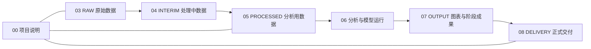
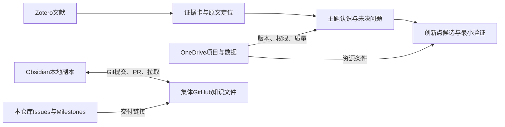

# 水利科研工作平台：产品说明 V0.5

2026-09-04｜本版把OneDrive实体目录、证据规范和T01—T09整合到当前GitHub仓库。产品说明只讲系统边界和对象关系；详细操作留在一份操作手册，证据规则继续使用V0.4。

## 要解决的问题

收到项目文件、数据和文献以后，使用者需要立刻判断：实体文件放哪里，文献由谁管理，科研认识写在哪里，团队怎样评议，以及每一步用什么证据判断完成。系统同时要防止原始数据被覆盖、同一正文维护两份、私人路径冒充团队入口、文件存在冒充科学结果。

## 五个位置各管一件事

| 位置 | 正式职责 | 与下一处怎样连接 |
| --- | --- | --- |
| OneDrive | 项目原件、RAW/INTERIM/PROCESSED数据、运行记录、图表、交付和归档 | Obsidian记录`PRJ/DATA`编号、网页链接、版本、用途与权限 |
| Zotero | 题录、DOI、合法PDF/附件、版本关系和原文批注入口 | 文献目录与证据卡回到条目、官方来源和实际阅读范围 |
| Obsidian | 文献链接、证据卡、主题、未决问题、创新点候选和项目数据入口 | 编辑集体知识仓库的本地副本 |
| 集体GitHub仓库 | 可共享的同一套Markdown、修改历史、PR评议与恢复 | Issue链接到实际文件/PR；不上传数据、全文、数据库和凭据 |
| 本GitHub仓库的Issues/Milestones | 产品说明、证据规则、操作手册、任务和里程碑 | 管工作状态与验收，不保存项目数据，不复制知识正文 |

## OneDrive的实体结构

OneDrive根目录使用`水利科研工作`，分成九个一级区域：总入口、进行中项目、共享数据资源、公共基础资料、现场调查与设备、成果与交付资产、模板与公共文件、文件交换区、已结束项目。每个进行中项目使用`PRJ-YYYY-NN_项目简称`，内部按以下证据链流转：

RAW不覆盖；INTERIM记录处理输入、步骤、参数与输出；PROCESSED记录质量、字段和适用边界；运行记录输入数据版与代码版本；OUTPUT允许迭代；DELIVERY只保存实际提交的冻结版本。会被多个项目复用的数据进入`20_共享数据资源`，项目引用编号和版本，避免复制。

## 知识怎样从材料产生

链接只能证明入口存在。证据卡中的声明仍需核对原文；数据文件、脚本运行和图表生成也不能自动证明科研结论。正式主题、机会、选题和成果出口继续遵守导师主库现行权限与停止线。

## 现有任务怎样落地

- T01建立OneDrive固定骨架和第一个真实项目入口，并确认权限、Zotero集合、Obsidian副本和集体GitHub仓库。
- T02—T03把真实来源与版本交给Zotero和证据卡；项目报告若来自OneDrive，同时登记原件版本与页码。
- T04—T06把证据用于主题、问题和创新候选，并链接实际数据条件；缺数据就写缺口，不制造资产或结果。
- T07只提交知识Markdown和索引，排除OneDrive实体文件、全文、数据库、凭据与本机路径。
- T08用一份真实材料和实际走过的数据链检查来源、权限、版本、推理和远端读回；T09修复真实缺陷并在原出错步骤复验。

## 当前状态

OneDrive目录设计和执行步骤已经写入本GitHub仓库及本地Obsidian文档。实际OneDrive根目录、真实项目目录、共享成员和权限仍须在T01中由真实账号建立并核对；文档更新不改变任何Issue或里程碑的完成状态。

## 详细入口

- [证据卡规范：八类材料、填写字段与原文核查](../证据卡规范/01_八类证据卡分类与填写说明_V0.4.md)
- [操作手册：OneDrive建库到GitHub读回](02_科研工作操作手册_V0.5.md)
