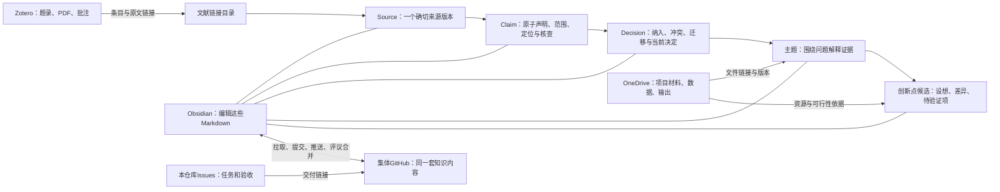

# 科研工作操作手册 V0.5

2026-09-04更新。本手册按本轮明确的分工编写：项目与数据放OneDrive，文献交给Zotero，来源卡、声明、平台决策、主题和创新点在Obsidian编写，通过GitHub协作。下面的目录是待接入集体库的工作约定，不代表已经迁库或自动同步；现有导师正式主库的内容与审批规则继续有效。

## 先看懂最终要做成什么

你拿到一份资料后，把它收进Zotero，在Obsidian登记唯一来源版本，按 L0—L3 读取并建立可定位的 Cxx 声明。需要比较来源时先用平台决策卡处理纳入、排除、同源依赖、冲突和适用边界，再把有依据的认识写进主题；产生研究想法时，在主题中记录创新点候选和待验证问题。项目材料、数据和分析输出保存在OneDrive，知识页面只引用它们的链接。最后把本次修改通过GitHub交给集体库。

| 软件或位置 | 具体放什么 | 日常在这里做什么 | 去哪里找依据 |
| --- | --- | --- | --- |
| OneDrive | 已获准使用的项目文件、原始数据、处理数据、分析输出 | 保存、整理、记录版本和访问范围 | 知识页面保存文件/文件夹链接及所用版本 |
| Zotero | 题录、DOI、PDF、补充材料、原文批注 | 收录、去重、核对身份、读原文 | 文献目录和证据卡链接回对应条目与出版来源 |
| 个人电脑的Obsidian | 集体知识库的本地工作副本：文献链接、证据卡、主题、创新点候选 | 阅读、写作、修改、比较和讨论 | 同一份Markdown持续更新，不另外维护“最终版2” |
| 集体GitHub仓库 | 经检查允许共享的上述Markdown及其修改历史 | 保存远端副本、查看修改、评议和合并 | 文件正文和历史可追溯；全文和项目数据不随之上传 |
| 本GitHub仓库的Issues/Milestones | 项目说明、规范、操作手册和工作任务 | 看下一步、记录阻碍、验收交付 | Issue链接到实际交付，不重复粘贴整份文档 |



图中的箭头表示你能够找到对应对象和依据，暂不表示已经建成自动导入程序。

## 第一次使用：先把四个入口填实

打开[工作入口与开始记录](../产品与流程/03_工作入口与开始记录_V0.5.md)，逐项填入真实地址。这是T01要交付的文件。没有地址就写“待提供”，不要写示例网址，也不要勾选接入完成。

### 1. 找到OneDrive项目文件夹

1. 在浏览器打开你用于集体工作的OneDrive，找到本项目已存在的文件夹。已有项目文件时沿用它，不再建同名副本。
2. 打开文件夹，确认里面是什么项目、谁有访问权限；记录文件夹显示名称。
3. 在“共享/管理访问”中查看现有访问范围。给已有成员使用时优先复制“已有访问权限的人员”链接；复制链接本身不应扩大权限。若缺少成员访问权，记为待处理，不改成任何人可访问。
4. 把网页链接填到入口记录；再点击一次，确认回到同一项目文件夹。
5. 本机若已同步该文件夹，再记本机位置；本机盘符路径只供自己找文件，给集体使用的是网页链接。未同步时可以先用网页版，不能把“能看网页”记成“本机离线可用”。

**完成后应看到：** 项目文件夹名称、网页链接、当前账号实际权限、检查日期。其他成员的可访问性未实测就写未验证。

### 2. 确认集体知识仓库，再让Obsidian打开它的本地副本

1. 打开本仓库首页，核对仓库名为`wangxinyu20429-dotcom/Water-Conservancy-Intelligent-Platform`；任务、文档和提交均从本仓库进入。
2. 当前电脑这个黑曜石主库已有自己的远端，不能因为要协作就替换它。先在入口记录填明：现有个人主库、拟用集体仓库、准备共享的内容范围。Project里的Issue属于哪个仓库，也不能代替这项确认。
3. 以下以GitHub Desktop操作。确认集体仓库后，打开软件，选择“File → Clone repository”，填该仓库地址，选择一个在现有主库和OneDrive之外的本地文件夹，再点“Clone”。若已存在同一仓库的本地副本，直接打开它，不重新克隆。
4. 打开Obsidian的仓库切换器，选择“打开文件夹作为仓库”，选上一步得到的文件夹。这样，你在Obsidian修改的就是将要提交给集体的那些文件。
5. 新副本用于集体知识工作；现有个人正式主库继续独立保存。已有正式笔记需要向集体分享时，先确认公开范围和唯一正文归属，再做一次明确交接，不能长期手工维护两份正式正文。
6. 先从已有知识目录继续工作。有真实新材料、确实缺少对应目录时，再按下面的目录约定创建所需文件。

**完成后应看到：** Obsidian与GitHub Desktop指向同一个本地文件夹；该副本指向确认过的集体仓库。首次核对可以打开同一个README检查内容，但不能用此证明全文、链接或科研结论均已验证。

### 3. 找到Zotero中的工作集合

1. 打开Zotero，确认当前使用个人库还是已加入的群组库，并记录库名及集合名。
2. 找到本轮真实文献；若尚未收录，按下一节操作。不要为了测试把整个历史库重新导入。
3. 打开该条目下的PDF，核对能否阅读；若只有摘要或出版页面，记录实际可读范围。
4. 能取得团队可用的Zotero网页条目链接时记下它；没有时保留DOI或官方出版链接，并注明Zotero入口目前仅个人可用。

**完成后应看到：** 能从条目找到实际材料，知道读到哪里。Zotero数据目录不搬入OneDrive；其数据库应使用Zotero支持的同步方式管理。[Zotero官方说明](https://www.zotero.org/support/kb/data_directory_in_cloud_storage_folder)

### 4. 确定今天要处理的材料和问题

在入口记录写：“今天处理〔真实题名/报告名〕，我想弄清〔具体问题〕。”本轮只处理你明确选中的材料。没有全文时可以登记链接和缺口；不能靠标题补写方法、数字或作者结论。先完成有条件完成的步骤，不为凑卡片数或创新点数加工其他材料。

## OneDrive先建成什么样：项目文件和数据的实体目录

OneDrive根目录统一命名为`水利科研工作`。第一次只建立下面的固定骨架、一个真实项目目录和确实要用的说明文件；没有真实项目、数据或运行时，不创建假文件填充目录。

```text
水利科研工作/
├─ 00_总入口/
├─ 10_进行中项目/
│  └─ PRJ-YYYY-NN_项目简称/
│     ├─ 00_项目说明/
│     ├─ 01_任务与管理/
│     ├─ 02_项目资料与正式依据/
│     ├─ 03_原始数据_RAW/
│     ├─ 04_处理中数据_INTERIM/
│     ├─ 05_分析用数据_PROCESSED/
│     ├─ 06_分析与模型运行/
│     │  ├─ 01_配置与输入清单/
│     │  ├─ 02_运行日志/
│     │  └─ 03_运行结果/
│     ├─ 07_成果与图表_OUTPUT/
│     │  ├─ 01_图/
│     │  ├─ 02_表/
│     │  └─ 03_阶段说明/
│     ├─ 08_正式交付_DELIVERY/
│     └─ 90_项目内归档/
├─ 20_共享数据资源/
│  └─ DATA-XXX_数据集简称/
│     ├─ 00_数据说明/
│     ├─ 01_原始数据/
│     ├─ 02_处理版本/
│     ├─ 03_元数据与字段表/
│     └─ 04_质量与许可/
├─ 30_公共基础资料/
│  ├─ 01_流域与行政边界/
│  ├─ 02_河网与站点/
│  ├─ 03_DEM与地形/
│  ├─ 04_土地利用与遥感/
│  └─ 05_参数表与公共字典/
├─ 40_现场调查与设备/
│  ├─ 01_调查表与原始记录/
│  ├─ 02_照片与视频/
│  ├─ 03_无人机与测量/
│  ├─ 04_设备说明与校准/
│  └─ 05_站点变更与维护/
├─ 50_成果与交付资产/
│  ├─ 01_报告/
│  ├─ 02_图集/
│  ├─ 03_数据包/
│  ├─ 04_汇报材料/
│  └─ 05_验收与投稿回执/
├─ 60_模板与公共文件/
│  ├─ Word/
│  ├─ Excel/
│  ├─ PPT/
│  └─ GIS/
├─ 80_文件交换区/
│  ├─ 01_待归档/
│  ├─ 02_待发送/
│  └─ 03_外部提交回收/
└─ 90_已结束项目/
```

### 每个一级目录解决什么问题

| 目录 | 放什么 | 不放什么 | 使用规则 |
| --- | --- | --- | --- |
| `00_总入口` | OneDrive网页入口、项目清单、负责人和权限检查日期 | 证据卡、主题正文 | 只做导航；每个项目链接到其`00_项目说明` |
| `10_进行中项目` | 每个真实项目的资料、数据、运行、输出和交付 | 跨项目重复复制的公共底图/数据 | 一个项目一个`PRJ-`目录，结束后整体归档 |
| `20_共享数据资源` | 会被多个项目使用的稳定数据集及元数据 | 为某项目临时产生的中间文件 | 数据只存一份；项目记录数据集编号、版本和链接 |
| `30_公共基础资料` | 流域边界、河网、DEM等公共底层资料 | 未核来源的下载堆 | 每项保留来源、日期、坐标基准、许可和适用范围 |
| `40_现场调查与设备` | 原始调查表、照片、测量数据、设备校准与维护 | 从原始记录推导的科研结论 | 人员、位置等敏感内容按最小权限共享 |
| `50_成果与交付资产` | 跨项目需要查找的正式成果副本与回执 | 分析过程中持续变化的草稿 | 必须能回到来源项目和正式版本 |
| `60_模板与公共文件` | 可复用的空白办公/GIS模板 | 已填入某项目事实的文件 | 更新模板要写版本；项目使用时复制到项目内 |
| `80_文件交换区` | 短期待归档、待发送、外部回收文件 | 长期正式保存内容 | 每周清理；归位后删除交换副本 |
| `90_已结束项目` | 已关闭项目的完整项目目录 | 仍在日常改动的活动项目 | 归档前核对交付、入口、权限与项目说明 |

### 一个项目内部怎样流转

1. 在`10_进行中项目`复制项目骨架，命名为`PRJ-YYYY-NN_项目简称`。`NN`按当年真实项目顺序登记；名称使用稳定短名。
2. 在`00_项目说明/README_项目入口.md`填写项目编号、目的、范围、参与者、OneDrive网页链接、GitHub任务入口、Zotero集合、主要数据和当前阶段。未知项写“待确认”。
3. `01_任务与管理`放合同允许保存的计划、会议原件和任务附件；会议形成的正式科研判断与任务仍写回Obsidian/GitHub。
4. `02_项目资料与正式依据`放申请书、任务书、批复、技术要求、正式来文等原件。作为文献证据使用的报告还要在Zotero登记，并在证据卡记录页码/章节；两个入口不算两份证据。
5. 收到的原始数据完整放入`03_原始数据_RAW`。不在原文件上清洗，不用同名处理结果覆盖；新到版本单独保存并说明与旧版关系。
6. 解压、格式转换、裁剪、匹配、清洗等阶段结果放`04_处理中数据_INTERIM`。每批写清“输入版本→脚本/软件与参数→输出文件→异常”。
7. 完成单位、坐标、缺测、字段和质量检查后，分析就绪数据进入`05_分析用数据_PROCESSED`，附字段表、处理来源、适用范围和仍存在的限制。
8. `06_分析与模型运行`按一次真实运行保存输入清单、配置、代码版本/提交号、日志、时间与输出。代码正文保存在代码仓库；OneDrive只保存运行所需配置、日志和成果，不能用“脚本能跑”证明科学结论正确。
9. 图、表和阶段解释进入`07_成果与图表_OUTPUT`。每项写明来源数据版本、运行版本、图表含义及不能支持的判断。
10. 真正提交给导师、甲方、期刊或验收方的冻结版本进入`08_正式交付_DELIVERY`，保存提交日期、对象与回执；修改稿建立新版本，不覆盖已交付文件。
11. 被取代但因追溯必须保留的材料进入项目内`90_项目内归档`。项目结束后核对交付和入口，再把完整项目目录移入根目录`90_已结束项目`。

### 四个必要说明文件

项目开始时至少建立以下说明，正文可用[工作页面填写模板](../产品与流程/04_工作页面填写模板_V0.4.md)中的“项目与数据入口”字段补充：

1. `00_项目说明/README_项目入口.md`：项目身份、范围、人员、权限、入口、阶段。
2. `03_原始数据_RAW/README_原始数据说明.md`：来源、获取日期、原始文件清单、校验值、时空范围、变量/单位、坐标/时区、许可和已知问题。
3. `04_处理中数据_INTERIM/README_处理记录.md`：输入版本、处理步骤、软件/脚本版本、参数、输出、失败与异常。
4. `05_分析用数据_PROCESSED/README_分析用数据说明.md`：由哪些输入生成、质量检查、字段、适用分析、不可用条件和版本。

跨项目共享数据集另在`20_共享数据资源/DATA-XXX_数据集简称/00_数据说明`写一份数据集说明。项目只登记编号、版本、稳定网页链接和本项目的用途，不再复制一套。

### 命名、共享与禁止项

- 文件名用`YYYYMMDD_内容_区域或对象_vNN_状态.ext`；状态只在含义明确时使用`RAW`、`INTERIM`、`PROCESSED`、`DRAFT`、`REVIEW`或`APPROVED`。不用“最终版2”“最新版”“新建文件夹”。
- 目录层级尽量控制在3—4层，避免过长路径和OneDrive不支持的字符。深层目录只在分析运行、图表或共享数据集内使用。
- 按具体项目目录共享给具体人员，只给确需修改者编辑权限；不把根目录整体公开。复制链接前先核对“管理访问”，链接不能代替权限测试。
- `80_文件交换区`是临时收发区。文件归位后记录正式位置，不能让交换区变成第二个资料库。
- 不放入OneDrive：`zotero.sqlite`及Zotero活动数据库、Git仓库的`.git`、Obsidian知识正文的平行副本、账号凭据、缓存、未经授权的全文或敏感材料。
- Microsoft对共享权限和路径长度可能更新，执行时以[OneDrive共享说明](https://support.microsoft.com/en-us/onedrive/share-files-and-folders-in-microsoft-onedrive)和[路径限制说明](https://support.microsoft.com/en-us/onedrive/what-are-file-path-length-limits)为准。文件组织采用来源、版本、README和逻辑层级原则，参考[USGS文件与数据组织指南](https://www.usgs.gov/data-management/organize-files-and-data)。Zotero数据库不放云盘同步目录，见[Zotero官方说明](https://www.zotero.org/support/kb/data_directory_in_cloud_storage_folder)。

### OneDrive怎样连接知识库

集体知识库的本地副本由Obsidian打开并用Git同步，知识目录只保存OneDrive网页链接、版本、用途与限制：

```text
集体知识库的本地副本/
  README.md
  文献链接/索引.md
  证据卡/年份_作者或机构_短题名.md
  主题/问题名称.md
  创新点/索引.md
  项目与数据/入口.md      ← 记录PRJ/DATA编号、OneDrive链接和所用版本
```

使用Markdown相对链接连接知识文件。在`项目与数据/入口.md`保存OneDrive网页链接；个人本机的`D:\...`不能当作团队入口。项目资料中的论文由Zotero管理题录和合法附件，OneDrive保存项目原件及版本。报告在OneDrive和Zotero各有入口时仍是一份来源。

### T01首次建库的逐项验收

- [ ] 根目录九个一级目录名称一致，没有另外建立“资料汇总”“临时最终版”等平行总库。
- [ ] 已为一个真实项目建立`PRJ-`目录并填写项目入口；没有真实项目时只保留模板并注明未实例化。
- [ ] RAW、INTERIM、PROCESSED、运行、OUTPUT、DELIVERY边界可由项目成员复述，README位置存在。
- [ ] 根目录未整体公开；当前账号权限、实际共享成员、编辑/查看范围和检查日期已经记录。
- [ ] `00_总入口`和Obsidian的`项目与数据/入口.md`均能回到同一网页对象；本机路径只作个人备注。
- [ ] 未把Zotero数据库、Git历史、知识正文、凭据或未经授权全文放入OneDrive。

建好目录只表示存储入口准备完成，不表示数据已经取得、模型已经运行、研究结论已经验证或项目已经归档。

## 日常操作A：拿到一篇论文、报告或其他资料

### A1. 先在Zotero查重，再收录

1. 用题名或DOI搜索Zotero，先看是否已经有条目。已有条目就补充附件或版本说明，不重复添加。
2. 新文献可以用DOI添加；没有DOI的报告或图书，用浏览器Connector或手动建立适合类型的条目。
3. 对照文献首页或官方页面核对题名、作者/机构、年份和标识。自动抓取错误就更正，无法确认就记录差异，不凭印象补全。
4. 把合法取得的PDF附到正确条目；检查附件题名、年份、版本是否一致。预印本、正式版、勘误、补充材料之间记录关系，不混成同一个版本。
5. 放入本轮集合，记录来源与获取日期。网页会变时记录你实际读的是哪个版本或更新日期。

**交付：** 一个身份明确的Zotero条目，或“身份待核/仅有摘要”的真实记录。对应T02。

### A2. 在Obsidian登记文献链接

打开“文献链接/索引.md”，增加或更新该来源的一行。使用[配套填写模板](04_工作页面填写模板_V0.4.md)中的文献目录表。至少写题名、类型、年份/版本、DOI或官方页面、Zotero入口、证据卡入口、实际可读范围。

目录只帮助你找材料，不重抄完整题录和证据卡摘要；题录修订以Zotero为准。证据卡还没建立时写“未建立”，不预先制造断链。只有本机Zotero链接时，另有官方来源链接供他人核对，不声称团队能打开你的附件。

**交付：** 从目录可回到正确来源。一个来源只登记一行；不同实质版本明确区分。

### A3. 先确定来源身份、证据角色和完成级别

1. 用题名、DOI／报告号、作者或机构、年份和版本检查是否已有相同 source_manifestation_id。相同版本只维护一张来源卡；预印本、正式版、勘误、数据快照或软件 release 用 source_work_id 和 version_family_ids 连接。
2. 分开选择 artifact_type 和 evidence_roles。artifact_type 表示对象本身是什么；evidence_roles 表示它在当前问题中提供原创研究、数据质量、软件验证、规范要求等哪些证据。一个来源可有多个角色，不为每个角色复制整张卡。
3. 选择最低够用级别：只登记用 L0；判断是否继续读用 L1；要进入主题或决策综合用 L2；高影响、争议、复现或安全问题且三门判定同时通过时才用 L3。
4. 从[证据卡科学架构与 Zotero Skill 使用 V1.2](../证据卡规范/07_证据卡科学架构与Zotero_Skill使用_V1.2.md)进入。01—08 各是一个来源类型入口，生成器会把[公共骨架](../证据卡模板/00_公共来源证据卡骨架_V1.2.md)、类型入口和条件模块装成一个独立 Markdown。
5. 先填写 source_work_id、source_manifestation_id、版本、快照、取得渠道、取得时间、Zotero item key、实际 reading_scope 和访问级别。动态标准、政策、数据和软件同时填写 validity_checked_at 与 recheck_trigger。
6. 缺失字段只使用 not_applicable、not_obtained、not_read、not_reported、not_found_after_check、conflict_pending，并在需要时写检查范围和理由。

**检查点：** L0／L1 的 verification_readiness 只能是 clue_only 或 currently_unusable，applicability 不能是 direct，也不能预填 verified_claim_ids。

**交付：** 一个确切来源版本的一张卡，别人能判断读到了什么、没读到什么和为什么没有继续。对应T03的来源登记与筛选部分。

### A4. 按来源类型、方法和水利情境装配 L2 卡

1. 选择一个来源类型入口：原创研究、综述、调查监测统计、工程报告、图书章节、标准指南政策、数据产品或软件模型代码。
2. 只要结论依赖具体水体、流域、站点、工程、时段、洪旱事件或气候情景，就加入[公共水利情境模块](../证据卡模块/01_公共水利情境模块.md)。记录原始单位与平台单位；发生转换必须写 conversion_rule。
3. 按真正的方法加入模块：预测与机器学习、水文水动力模拟、频率干旱气候、监测水质遥感、工程运行安全。一个来源可同时启用多个模块。
4. 在 Zotero 打开实际附件。先确认附件与登记版本一致，再读当前研究问题所需的研究设计／生成过程、决定性结果、局限、附录或版本说明。
5. 只填当前模块需要的栏目。没有使用某种方法就不展开对应模块；不能为了看起来完整而补写来源没有的内容。

**检查点：** 来源类型回答“证据怎样产生”，方法模块回答“这种推断必须核什么”，water_context 回答“结论发生在什么水利条件下”。三者不得混成一个类型名称。

### A5. 把决定性内容拆成可核查 Cxx 声明

1. 每个 claim-json 只表达一个命题，并分配全局唯一 claim_id。claim 的 source_id 必须等于本卡 source_manifestation_id。
2. 先写 statement_role：source_fact、author_interpretation 或 analyst_judgment；再写 inference_type。作者解释和分析者判断不得冒充原文事实。
3. 写清证据生成来源、对象或分母、空间、时间、比较条件和精确定位。定位至少能让另一个人打开同一版本后回到对应页、节、图表、条款、记录、变量或代码位置。
4. 数字同时记录 value、reported_unit、对象或分母、时空范围、比较条件和 uncertainty；来源没有报告不确定性时写 not_reported，不能留空后进入已核状态。
5. 因果声明填写识别设计、混杂和替代解释；预测声明填写起报时点、预见期、决策时可得信息和独立验证；跨流域迁移填写目标情境匹配与迁移差距；规范声明填写适用范围并把规范效力与科学有效性分开。
6. 分别写 directly_supports 和 does_not_support，再填写 support_status。not_supported、contradicted、not_reported 和 not_checked 不能互换。
7. 用 supports、contradicts、qualifies、depends_on、reproduces、supersedes 连接声明；用 independence_group_ids 和 version_family_ids 标记共享站网、数据集、项目、模型和版本，避免综合时重复计数。
8. 最后生成“快速决策摘要”，只展示最多三条承重 claim_id；完整档案中的声明数量不设上限。

**交付：** 每项将用于主题或决策的事实均有确切版本、范围和 locator。论文内部的阅读顺序仍可参考[十二步阅读手册](../证据卡规范/05_单篇论文阅读执行手册_V0.3.md)。

### A6. 人工复核、机器校验和升级状态

1. 同时打开卡片与原始材料，逐条复核所有决定性 Cxx。检查方向、单位、分母、比较条件、不确定性、脚注、限定语和图表上下文。
2. 每条核过的声明写入 verified_claim_ids，并记录 verified_by、verified_at；不同声明允许有不同核验状态，不能给整篇来源贴一个笼统“可信”标签。
3. AI 辅助时填写 extraction_method、generator_or_pipeline_version、source_snapshot_hash、human_review_status 和 human_reviewer。AI 抽取置信度不能代替证据确定性或目标流域适用性。
4. 分别判断 relevance、verification_readiness、applicability 和 decision_effect；不要压成“可用／不可用”一个总评。
5. 运行 R01—R08 校验。机器 PASS 只说明结构没有触发已编码错误；人工复核和科学判断仍然必需。
6. 存在未解决承重冲突时设置 load_bearing_conflict 和冲突 ID，不得进入 approved、verified 或 direct。

**交付：** 一张达到真实 L2 或 L3 的来源卡，或一张明确说明仍处于 L0／L1 及其阻碍的卡。资料不足可以保存，不能伪装成完整验收通过。

### A7. 需要跨来源结论时建立平台决策卡

1. 只有达到 L2／L3 的声明才可纳入[平台证据综合与决策卡](../证据卡模板/09_平台证据综合与决策卡模板.md)。发表的综述仍是来源卡，不能替代平台决策卡。
2. 写明 research_question_id、decision_id、决策阈值、目标流域／场景、决定人和 as_of_date。
3. 分别列出纳入、排除的 claim_id 及排除理由；按 independence_group_ids 和 version_family_ids 合并同源证据，不能按论文篇数简单计票。
4. 公开一致、相反、限制和未解决证据，检查覆盖范围和目标情境迁移差距。
5. 对直接性、内部有效性、独立性、精确性、适用性和可复现性分别给高／中／低／未知，并列 basis_claim_ids；不计算跨类型总分。
6. 明确当前支持什么、不支持什么、决定是什么、还差什么证据和什么事件触发复核。

**交付：** 一个可回到每条 claim_id 和原始定位的当前决策。未解决承重冲突时只允许暂缓或补证，不允许 approved。

## 日常操作B：从证据卡推进到主题和创新点

### B1. 先找已有主题，再决定是否需要新候选

1. 在Obsidian搜索研究问题及同义表达，打开现有主题，看边界是否相符；不能仅凭关键词相同就归入。
2. 对每张相关卡写清关联作用：提供背景、支持某项判断、限定适用范围、提供方法、暴露数据缺口，或无法比较。
3. 在主题页先写连续可读的认识：现在研究的问题是什么、文献分别解决了哪一部分、哪些条件下可用、还有什么不知道。
4. 需要比较时才加比较表：数据、区域/时期、任务、划分方式、指标定义、基线、结果、限制和来源。不同口径单独说明，不能直接排“谁最好”。
5. 单篇材料只能支持有限线索。没有足够材料形成跨文献认识，就记录局部增量和缺口，不把它命名为“领域共识”。

**交付：** 对已有主题的具体修改建议或一个有边界的候选段落。既有正式主题的建立、拆分、核心判断修改和机会升级仍按现行授权处理；写了草稿不等于批准应用。对应T04。

### B2. 对话中有问题，先找到缺的是哪项证据

在主题“未决问题”写下问题、现有依据和缺口。让AI回答时要求列出卡片及原文位置；不能找到证据时就保留“目前不能回答”。只有当前确需决定、缺口具体、能找到可能解决它的最小材料时，才安排定向补读。比如读一个图的脚注、方法中的划分说明或补充材料的某一节，而非默认再读整篇。

补读完成后回到原证据卡补上新信息，注明前后变化；再更新主题的候选修改。没有真实补读需求时，记录“本轮未触发”，不为完成任务制造一个问题。对应T05。

### B3. 产生创新点时，在主题里写出可以被质疑的完整设想

使用[创新点候选段落模板](04_工作页面填写模板_V0.4.md)填写：要解决的问题、现有工作做到哪、还缺什么、你的设想、与最接近工作的具体差异、已有证据、可能推翻设想的情况、所需数据与方法、下一项验证及停止条件。

“我还没找到别人做过”不等于没人做过；新颖性检索没有做，就标未检索。作者提出的未来工作也不自动成为你的创新。先把候选正文放在来源主题内；“创新点/索引.md”只链接过去。后续获准成为独立对象时再交接正文和回链，避免主题里一版、创新点文件里又一版。

**交付：** 有据可查的候选或“暂不能提出”的具体原因。没有可行候选也是有效结果，不强造创新点；正式研究机会与正式选题不由这个流程自动产生。对应T06。

## 日常操作C：把OneDrive项目和数据真正接进来

遇到具体项目或数据需求时，打开“项目与数据/入口.md”，按配套模板填写。

1. 找到实际OneDrive文件或文件夹；记录名称、来源、覆盖区域/时间、当前权限和稳定链接。
2. 保留原始文件。确需处理数据时另存处理版本，写明输入是哪一版、做了什么处理、输出在哪里；没有运行就只记计划。
3. 记录所用文件版本、日期和必要的文件校验值；OneDrive同一链接下内容可能更新，链接不能代替版本记录。重要分析应能回到当时实际使用的输入。
4. 在相关证据卡或主题中链接该条目，写清作用，例如“判断是否有适用的逐小时降雨数据”；不要只堆链接。
5. 判断数据是否够用：变量、单位、空间与时间分辨率、时区、坐标/高程基准、缺测、质量标识、许可。缺哪项，就写哪项尚不能判断。
6. 实际输出回OneDrive；知识页记录输入、过程说明、输出链接和可支持范围。文件存在、脚本跑通、生成了图，都不自动证明研究结论有效。

**交付：** 从主题或候选能打开相应项目/数据，并知道具体使用版本。还没有真实数据就写待取得，不创建假数据集、假运行或假验收。

## 日常操作D：把Obsidian修改同步给集体GitHub

这部分采用手动同步，先让每一步可见。GitHub Desktop的按钮会随当前分支状态变化；当前本地未安装或未登录时，先完成安装/登录再执行，不能写成已经配置了自动同步。

### 开始写之前

1. 打开GitHub Desktop，核对当前仓库是已确认的集体知识库。
2. 看“Changes”：有未提交修改时，先辨认并保留它们，完成或单独保存本次工作；不为了拉取而删除别人的内容。
3. 在干净的目标分支点击“Fetch origin”；若有远端更新，点击“Pull origin”。无新更新时可能没有Pull按钮。
4. 新任务从更新后的主分支建立工作分支；续做旧任务就回到原工作分支。分支名应表达具体任务。Codex新建分支使用`codex/`前缀。
5. 回到Obsidian编辑对应文件。看到的是同一个本地副本，无须再手工复制一遍。

### 写完之后

1. 等待Obsidian写入本地文件，回GitHub Desktop查看“Changes”，逐个打开本次修改。
2. 核对只包含这次要共享的知识文件及必要索引；排除原文PDF、项目原件、数据文件、凭据、Zotero数据库、临时缓存和个人界面状态。选文件提交，不点击不加检查的全选。
3. 写一句中文修改说明，例如“补充某主题的资料来源与适用条件”，提交到当前工作分支。此时只是记入本地历史。
4. 点击“Push origin”；分支第一次上传时可能显示“Publish branch”。此时只是更新远端工作分支。
5. 用“Create Pull Request”发起修改评议。说明改了哪些文件、依据是什么、哪些地方待核、关联哪个Issue；不要声称自己完成了独立复核。
6. 在GitHub打开这次提交的文件，点文献、证据卡、主题和OneDrive链接，检查正文显示和地址。无权访问的材料保留明确状态，不修改成公开链接。
7. 正式合并依仓库现行权限与检查要求完成。合并后切回主分支并拉取，才会在主分支的本地副本里看到这次结果。
8. 在Issue里写交付文件/PR链接、已完成的核查和仍受阻的项目，再更新任务状态。模板写完或PR已创建都不自动意味着科研任务完成。

发生冲突时：先看哪一个文件、哪几句话不同，对照原文和修改目的后合并，检查两边有效内容都被保留。不能通过“全部采用我的版本”、强制推送或清空目录来跳过判断。

Git需要显式提交、推送和拉取；文件已保存不等于团队已经收到。[Obsidian同步说明](https://obsidian.md/help/sync-notes) · [GitHub分支同步说明](https://docs.github.com/en/desktop/working-with-your-remote-repository-on-github-or-github-enterprise/syncing-your-branch-in-github-desktop?platform=windows)

## 第一轮怎么安排：不用一次把所有东西做完

| 顺序 | 今天具体做什么 | 做完看什么 | 对应任务 |
| --- | --- | --- | --- |
| 先把入口填实 | 确认OneDrive、Zotero、集体仓库、本地副本 | 工作入口记录里能打开正确地址 | T01 |
| 选一份真实材料 | Zotero核对身份、文献目录登记 | 可从目录找到正确材料，范围如实标明 | T02 |
| 做出可核对证据卡 | 选类型、读原文、填写、复查 | 使用的事实和数字有具体原文定位 | T03 |
| 让卡片进入问题讨论 | 更新已有主题候选段落，必要时比较 | 说清补充了什么认识，不能判断什么 | T04 |
| 处理实际缺口 | 有决定性问题才补读 | 结果回原卡；未触发也如实记录 | T05 |
| 记录可检验设想 | 在主题记录候选或暂不提出的原因 | 依据、差异、验证需求都看得见 | T06 |
| 把修改交给集体 | 检查文件→提交→推送→PR→读回 | 远端文件与本次本地内容一致 | T07，可从首个真实文件开始 |
| 检查整条链 | 目录→来源→卡→主题→候选/停止记录→资源 | 各项实际通过/受阻/未触发有依据 | T08 |
| 修复具体问题 | 按问题改原文件，再回到出错步骤 | 能看到修改前后与复验结果 | T09，发现真实问题即可开始 |

T04—T06不是每篇材料都必须触发。T07贯穿日常工作；T08可诚实记录受阻，但里程碑所要求的真实操作未完成时不能关闭里程碑。你本人完成两次检查，记录为本人复查，不虚构另一位检查人。

## 遇到这些情况怎么继续

| 遇到什么 | 现在做什么 | 哪个结论暂时不能写 |
| --- | --- | --- |
| 只有DOI、没有全文 | 登记身份和入口，说明可读范围，取得材料后补同一卡 | 方法细节、结果数字和全文核验通过 |
| 目录有文献，Zotero找不到 | 用DOI/题名查重、核对库与版本，补正确入口 | 已完成文献管理接入 |
| OneDrive链接自己能开，别人未试 | 记录当前账号测试结果和权限范围 | 团队访问已验证 |
| 只有一个材料，不能形成主题认识 | 保留卡和一个具体待比较问题 | 领域共识或统一规律 |
| 原文互相矛盾 | 先检查对象、时期、定义和方法差异，再表述矛盾 | 凭印象判某文献错误 |
| GitHub不可访问 | 保留本地文件及待同步清单，恢复连接后重读远端再提交 | 已上传、已合并或团队可见 |
| 没有值得推进的创新候选 | 写清缺口与停止原因，保留来源 | 硬凑一个创新点 |

## 这次修改依据与边界

用户明确的是四处的职责分工。Git本地副本作为Obsidian工作目录、文献目录只存链接、候选正文留在主题内、手动评议同步，是本轮为避免重复和便于执行作出的设计选择；不声称是工具唯一支持的方式，也不代表已替换当前正式主库。

外部事实：Zotero不应把数据库目录放进OneDrive；Obsidian以本地文件为基础，Git同步需要主动操作；GitHub Desktop可以克隆与同步仓库；OneDrive的“已有访问权限”链接不改变访问权限。参见[Zotero](https://www.zotero.org/support/kb/data_directory_in_cloud_storage_folder)、[Obsidian](https://obsidian.md/help/sync-notes)、[GitHub克隆说明](https://docs.github.com/en/desktop/adding-and-cloning-repositories/cloning-and-forking-repositories-from-github-desktop)、[Microsoft共享说明](https://support.microsoft.com/en-us/onedrive/share-files-and-folders-in-microsoft-onedrive)。

本轮产品说明、操作手册、任务和里程碑已经迁入本GitHub仓库；Obsidian使用本仓库的独立本地副本。当前未确认的OneDrive共享目录、集体知识仓库地址、真实材料和访问测试，不以本手册写完代替。
