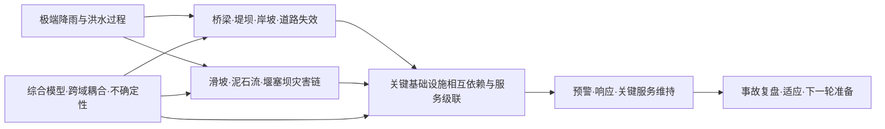

# “科研平台”集合候选主题与精读路线

## 本轮结论

42个来源可以形成五个**候选主题簇**。它们不是五个已经批准的正式主题，也不是把关键词分成五堆：每个候选都围绕一个可持续追问的科研问题，允许同一来源因承担不同作用进入多个候选。

当前所有综合都停在“候选档案”。原因很明确：只有L2/L3且完成人工source_checked的声明可以承担正式主题结论；本轮只有一张详细L2草稿，仍未完成导师／人工核验。因此主题文件只陈述初读方向、比较框架、文献优先级和补核任务，不制造共识、因果关系或研究空白。

## 五个候选主题

| 候选主题 | 输入来源 | 状态 | 已准入承重Claim | 下一步 |
| --- | ---: | --- | ---: | --- |
| [洪水作用下关键基础设施相互依赖与级联失效](01_洪水作用下关键基础设施相互依赖与级联失效.md) | 14 | 候选档案 | 0 | 先按文件内反推队列升级核心卡 |
| [洪水—滑坡—泥石流—堰塞坝多灾种链](02_洪水_滑坡_泥石流_堰塞坝多灾种链.md) | 13 | 候选档案 | 0 | 先按文件内反推队列升级核心卡 |
| [洪水综合建模、跨域耦合与级联不确定性](03_洪水综合建模_跨域耦合与级联不确定性.md) | 13 | 候选档案 | 0 | 先按文件内反推队列升级核心卡 |
| [洪水下桥梁、堤坝、岸坡与道路的失效机制](04_洪水下桥梁_堤坝_岸坡与道路失效机制.md) | 15 | 候选档案 | 0 | 先按文件内反推队列升级核心卡 |
| [洪灾预警、适应与应急治理证据链](05_洪灾预警_适应与应急治理证据链.md) | 13 | 候选档案 | 0 | 先按文件内反推队列升级核心卡 |

这张图表达问题关系，不代表已被当前证据验证的因果图。

## 主题之间怎样分工

- **结构失效主题**研究洪水直接作用到桥梁、堤岸和道路的物理过程及可监测状态。
- **多灾种链主题**研究前序过程怎样改变地形、物源和脆弱性，并进入下一灾害阶段。
- **基础设施级联主题**研究物理损坏怎样经网络依赖转化为电力、供排水、交通和关键设施服务中断。
- **综合建模主题**研究上述过程怎样被连接、验证和传播不确定性，是横跨其他主题的方法层。
- **预警治理主题**研究预测信息怎样转为响应、转移、服务维持和灾后学习，是从科学结果到行动的应用层。

## 第一轮精读顺序

1. **先完成已有详细卡：** EC-20260907-001，人工核对19条声明、图表、服务半径、预警时点与85／98医院数量差异。
2. **再读两篇近期综合证据：** EC-20260907-035（2024系统综述）和EC-20260907-016（2019多灾种方法综述），核对检索与纳入矩阵，用于查漏而非直接证明方法有效。
3. **精读2025动态研究：** EC-20260907-021、008、028，分别覆盖交通—排水、电力—污水和山洪—泥石流；重点检查阈值、校准、验证与不确定性。
4. **建立观测与实验锚点：** EC-20260907-009、001、029，分别提供跨事件观测验证、河岸地下水现场观测和串联坝控制试验。
5. **处理权威非论文来源：** EC-20260907-042做页码级事故调查卡；EC-20260907-017做条款级规范卡；EC-20260907-036等待正式调查报告；EC-20260907-037取得规划附件后再提指标。

## 年份与期刊影响怎样进入排序

新论文优先用于识别新方法、数据和近期争议，但“新”不提高声明本身的可信度。期刊影响因子只在指标名称、年份、学科口径和来源都可核验时进入阅读关注分；本批次尚无统一可审计指标，所以相关分量保持unknown，当前顺序依据问题直接性、证据设计、缺口关闭能力和年份暂定。WMO手册、IPCC章节、事故调查、经典方法论文和长时序证据按科学作用保留，不因没有JIF或发表较早而删除。

## 主题从候选变成正式主题的最低门槛

1. 核心问题与边界由导师确认，且与现有主题完成查重。
2. 至少两组相互独立的核心来源完成L2/source_checked；关键数值有定位，限定语与不支持内容清楚。
3. 同一比较框架内才能合并或比较结果；模型、实验、事件调查和规范分别承担适当角色。
4. 重要反例、失败条件和迁移差距被记录；未完成新颖性检索时不声称研究空白。
5. 主题反推的修改已写回原证据卡并重新计算，导师最后决定激活、观察、拆分或停止。

## 本轮机器校验

- 42张证据卡：draft校验全部PASS。
- 5份候选主题档案：draft校验全部PASS。
- PASS只说明字段、引用关系和状态边界满足skill规则，科学理解仍需回到Zotero原文人工复核。
